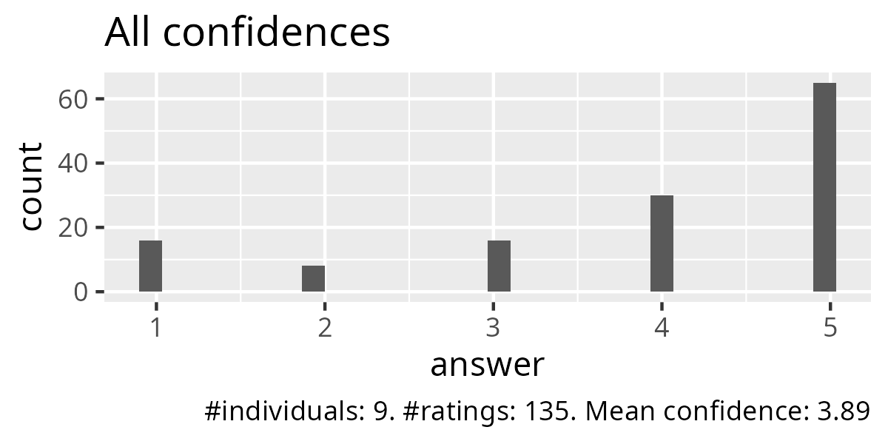
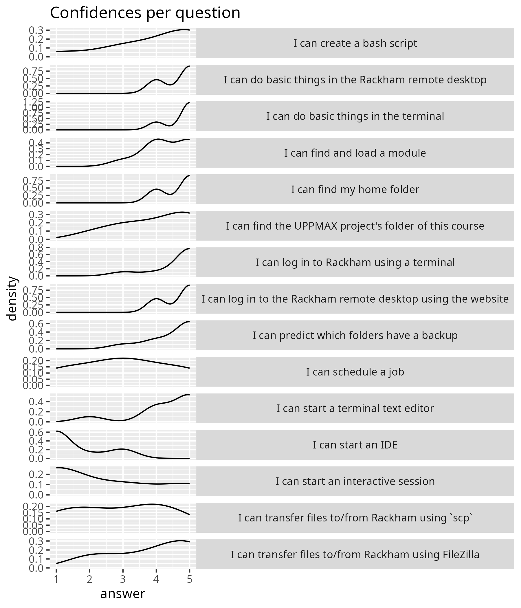
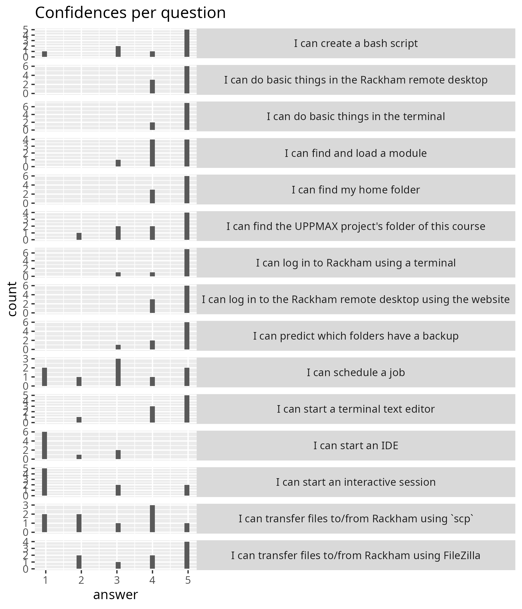

---
tags:
    - evaluation
    - 2025-02-10
---

# Evaluation 2025-02-10

- Number of learners at 14:45: 13
- Numer of responses: 9
- Response rate: 69%
- Reflections: [Richel](../../reflections/20250210/README.md)

- [anonymous_feedback.csv](anonymous_feedback.csv)
- [anonymous_feedback.zip](anonymous_feedback.zip)
- [learning_outcomes.csv](learning_outcomes.csv)
- [learning_outcomes.zip](learning_outcomes.zip)
- [observation.pdf](observation.pdf)

Feedback at end of confidences, with only spelling corrections added:

- 5x NA
- Day 1 on this course has been very useful,
  I learned a lot through these sessions,
  and I really liked doing the exercises in breakout rooms and
  discussing each question with others.
  I also liked Richèl's way of teaching,
  he was very positive and supportive.
- Very nice intro!
  Felt like being thrown unprepared into a swimming pool.
  But I didn't drown, thanks to other swimmers
  that showed me how to stay above the water. ;-)
- Richel is very nice and welcoming since the beginning of the class.
  The course is fun, less lectures more practicing.
  But it seems that the target for today may be a bit too much unless
  more time is added, or maybe extend the course to 4 days.
- For a complete beginner, the amount of information is huge.
  The [breakout rooms] and the way of teaching helped greatly.
  I do have to say the pace was quite fast tho and I am very happy
  to have had some people in the same [breakout rooms]
  that knew so much beforehand. Still, I am quite confused how to find
  everything that I want to do, especially all the commands and
  requirements before using the commands. The documentation is very nicely
  structured, and helped a lot, but for a total beginners it felt like a
  maze. I am a bit sad, that we could not try writing the script in the
  [breakout rooms] due to time [reasons] as I think that is quite important
  and I have low confidence in doing so on my own.
  Concluding, I feel that this course is very valuable especially
  with in this learning format but more time would have been needed.

Anonymous feedback:

- Great introduction to uppmax and linux, learned a lot!
- I enjoyed the teacher's way of interacting and engaging with us students.
  Making it feel like a safe environment for asking questions.
  Also liked working in smaller breakout rooms bit the downside being some
  interactions where more fruitful than others.
  Where it feels you can easily get lost
  and not follow if not everyone is on board of the students.
  But all in all a very useful session!

Mean confidences as a table:

| question                                                     | mean_confidence    |
| ------------------------------------------------------------ | ------------------ |
| I can create a bash script                                   | 4                  |
| I can do basic things in the Rackham remote desktop          | 4.666666666666667  |
| I can do basic things in the terminal                        | 4.777777777777778  |
| I can find and load a module                                 | 4.333333333333333  |
| I can find my home folder                                    | 4.666666666666667  |
| I can find the UPPMAX project's folder of this course        | 4                  |
| I can log in to Rackham using a terminal                     | 4.666666666666667  |
| I can log in to the Rackham remote desktop using the website | 4.666666666666667  |
| I can predict which folders have a backup                    | 4.555555555555555  |
| I can schedule a job                                         | 3                  |
| I can start a terminal text editor                           | 4.333333333333333  |
| I can start an IDE                                           | 1.5555555555555556 |
| I can start an interactive session                           | 2.3333333333333335 |
| I can transfer files to/from Rackham using FileZilla         | 3.888888888888889  |
| I can transfer files to/from Rackham using `scp`             | 2.888888888888889  |

Confidences as a tally:

| question                                                     | answer | n   |
| ------------------------------------------------------------ | ------ | --- |
| I can create a bash script                                   | 1      | 1   |
| I can create a bash script                                   | 3      | 2   |
| I can create a bash script                                   | 4      | 1   |
| I can create a bash script                                   | 5      | 5   |
| I can do basic things in the Rackham remote desktop          | 4      | 3   |
| I can do basic things in the Rackham remote desktop          | 5      | 6   |
| I can do basic things in the terminal                        | 4      | 2   |
| I can do basic things in the terminal                        | 5      | 7   |
| I can find and load a module                                 | 3      | 1   |
| I can find and load a module                                 | 4      | 4   |
| I can find and load a module                                 | 5      | 4   |
| I can find my home folder                                    | 4      | 3   |
| I can find my home folder                                    | 5      | 6   |
| I can find the UPPMAX project's folder of this course        | 2      | 1   |
| I can find the UPPMAX project's folder of this course        | 3      | 2   |
| I can find the UPPMAX project's folder of this course        | 4      | 2   |
| I can find the UPPMAX project's folder of this course        | 5      | 4   |
| I can log in to Rackham using a terminal                     | 3      | 1   |
| I can log in to Rackham using a terminal                     | 4      | 1   |
| I can log in to Rackham using a terminal                     | 5      | 7   |
| I can log in to the Rackham remote desktop using the website | 4      | 3   |
| I can log in to the Rackham remote desktop using the website | 5      | 6   |
| I can predict which folders have a backup                    | 3      | 1   |
| I can predict which folders have a backup                    | 4      | 2   |
| I can predict which folders have a backup                    | 5      | 6   |
| I can schedule a job                                         | 1      | 2   |
| I can schedule a job                                         | 2      | 1   |
| I can schedule a job                                         | 3      | 3   |
| I can schedule a job                                         | 4      | 1   |
| I can schedule a job                                         | 5      | 2   |
| I can start a terminal text editor                           | 2      | 1   |
| I can start a terminal text editor                           | 4      | 3   |
| I can start a terminal text editor                           | 5      | 5   |
| I can start an IDE                                           | 1      | 6   |
| I can start an IDE                                           | 2      | 1   |
| I can start an IDE                                           | 3      | 2   |
| I can start an interactive session                           | 1      | 5   |
| I can start an interactive session                           | 3      | 2   |
| I can start an interactive session                           | 5      | 2   |
| I can transfer files to/from Rackham using FileZilla         | 2      | 2   |
| I can transfer files to/from Rackham using FileZilla         | 3      | 1   |
| I can transfer files to/from Rackham using FileZilla         | 4      | 2   |
| I can transfer files to/from Rackham using FileZilla         | 5      | 4   |
| I can transfer files to/from Rackham using `scp`             | 1      | 2   |
| I can transfer files to/from Rackham using `scp`             | 2      | 2   |
| I can transfer files to/from Rackham using `scp`             | 3      | 1   |
| I can transfer files to/from Rackham using `scp`             | 4      | 3   |
| I can transfer files to/from Rackham using `scp`             | 5      | 1   |
