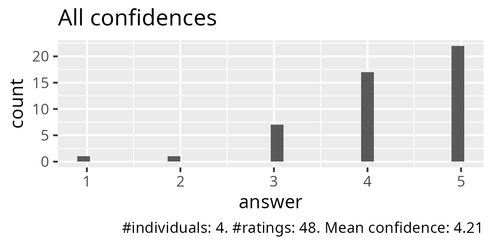
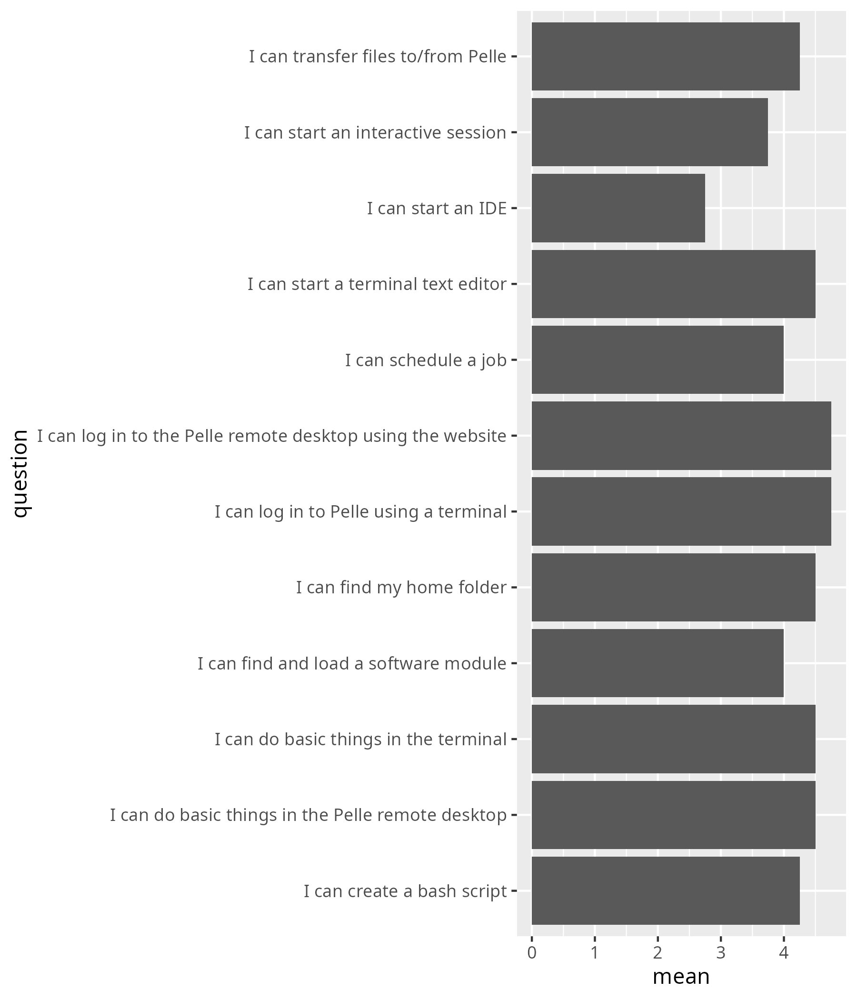
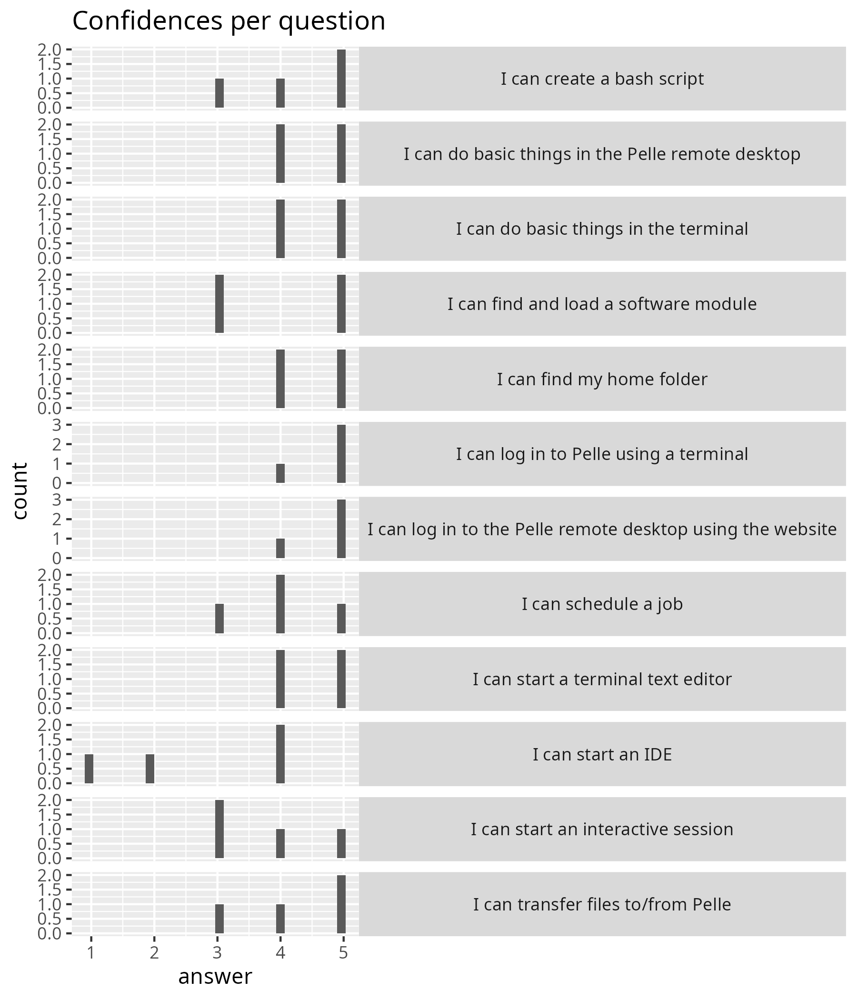
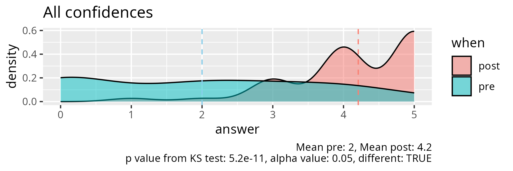
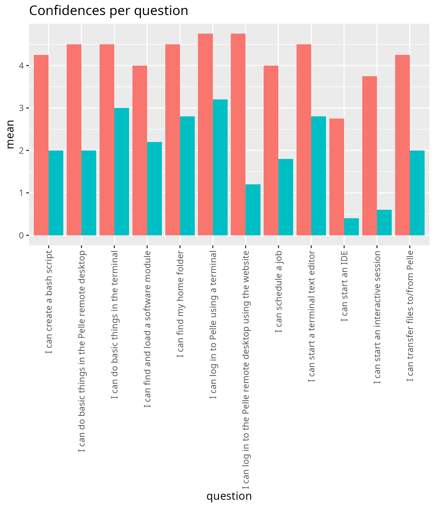
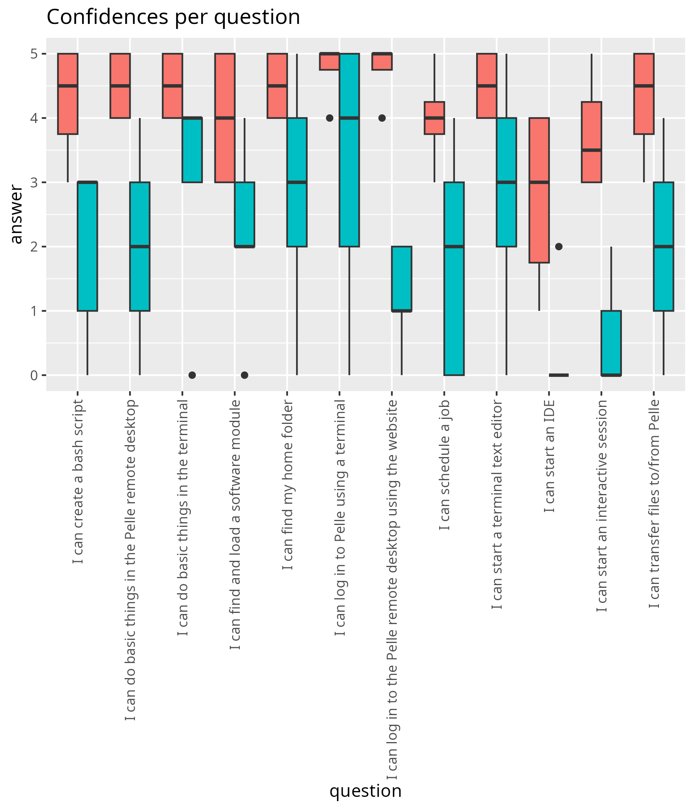
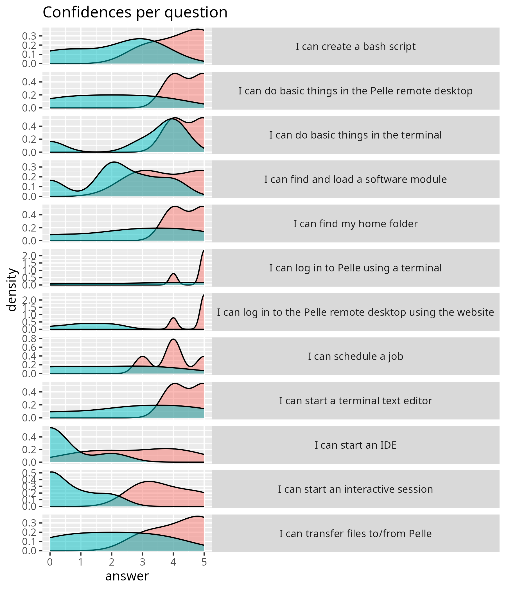

# Evaluation

- Date: 2025-10-15
- [Lesson plan](../../lesson_plans/20251015/README.md)
- [Evaluation](../../evaluations/20251015/README.md)
- [Reflection](../../reflections/20251015/README.md)
- Registrations: 15
- Number of active learners: 6 (50% show-up rate)
- Number of evaluations: 6 (67% fill-in rate)

## Results

- [anonymous_feedback.txt](anonymous_feedback.txt)
- [survey_start.csv](survey_start.csv)
- [survey_end.csv](survey_end.csv)
- [survey_end_text_question.txt](survey_end_text_question.txt)
- [success_score.txt](success_score.txt): 84%

## Feedback

None

## Analysis, only end

- script used: [analyse.R](analyse.R)
- [average_confidences.csv](average_confidences.csv)
- [success_score.txt](success_score.txt)

## Analysis, pre and post

- [analyse_pre_post.R](analyse_pre_post.R)
- [stats.txt](stats.txt)

<!-- markdownlint-disable MD013 --><!-- Tables cannot be split up over lines, hence will break 80 characters per line -->

|question                                                   | mean_pre| mean_post|   p_value|different |
|:----------------------------------------------------------|--------:|---------:|---------:|:---------|
|I can log in to the Pelle remote desktop using the website |      1.2|      4.75| 0.0169649|TRUE      |
|I can do basic things in the Pelle remote desktop          |      2.0|      4.50| 0.0334328|TRUE      |
|I can find my home folder                                  |      2.8|      4.50| 0.1631653|FALSE     |
|I can transfer files to/from Pelle                         |      2.0|      4.25| 0.0628118|FALSE     |
|I can log in to Pelle using a terminal                     |      3.2|      4.75| 0.2807127|FALSE     |
|I can do basic things in the terminal                      |      3.0|      4.50| 0.0796158|FALSE     |
|I can find and load a software module                      |      2.2|      4.00| 0.1023575|FALSE     |
|I can start a terminal text editor                         |      2.8|      4.50| 0.1631653|FALSE     |
|I can create a bash script                                 |      2.0|      4.25| 0.0397734|TRUE      |
|I can schedule a job                                       |      1.8|      4.00| 0.0785459|FALSE     |
|I can start an interactive session                         |      0.6|      3.75| 0.0174510|TRUE      |
|I can start an IDE                                         |      0.4|      2.75| 0.0388671|TRUE      |

<!-- markdownlint-enable MD013 -->
