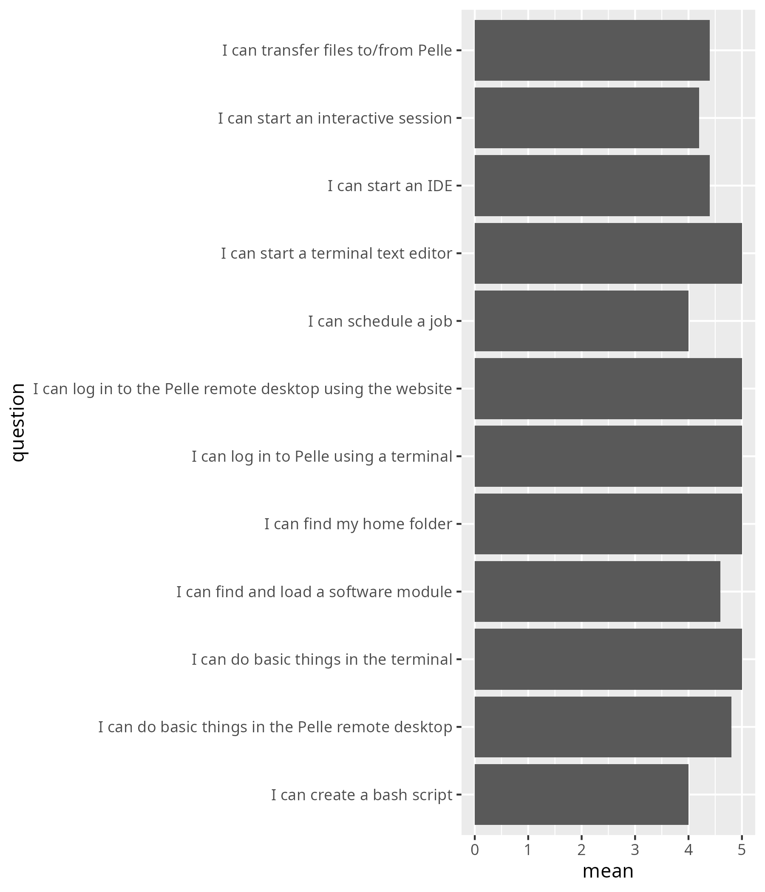
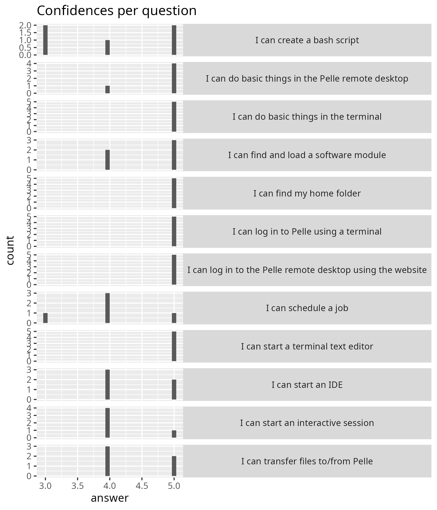
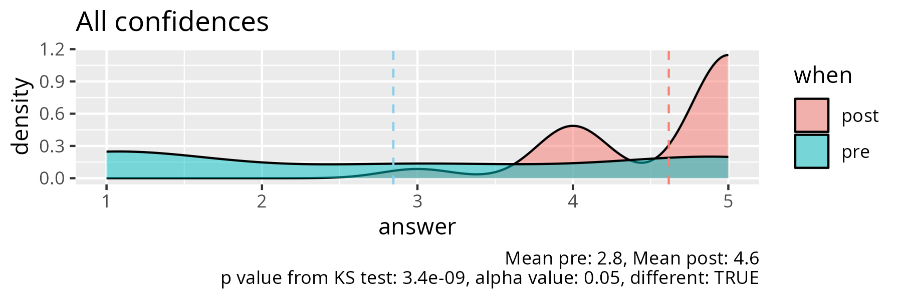
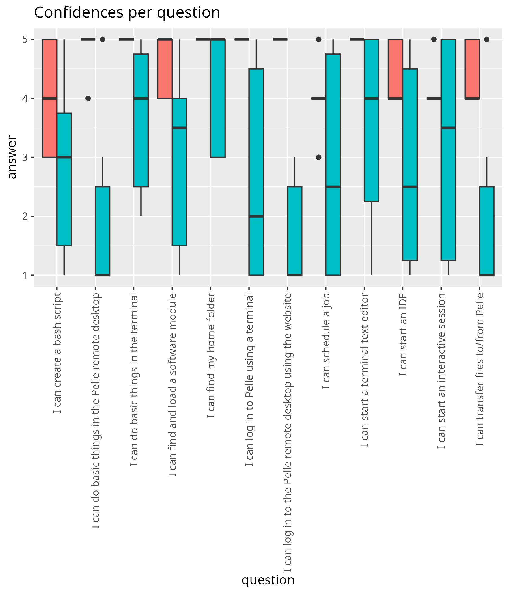
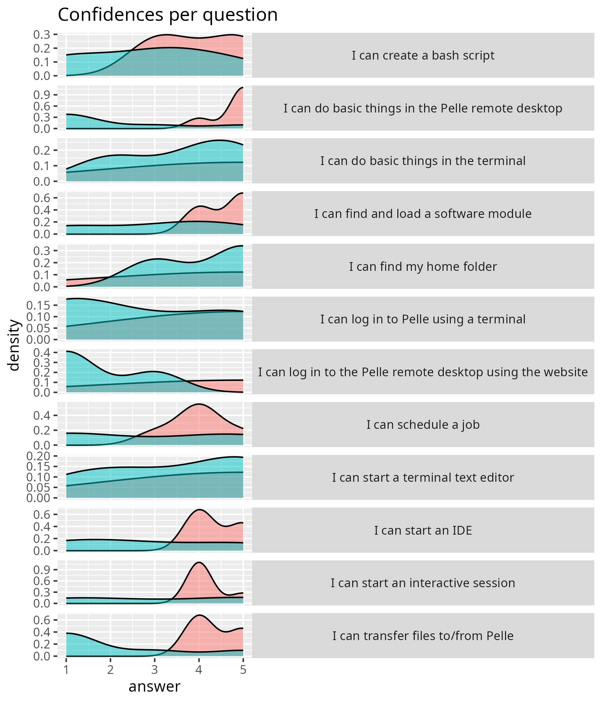

# Evaluation

- Date: 2026-01-19
- [Lesson plan](../../lesson_plans/20260119/README.md)
- [Evaluation](../../evaluations/20260119/README.md)
- [Reflection](../../reflections/20260119/README.md)
- Registrations: 17
- Number of active learners: 8 (47% show-up rate)
- Number of evaluations: 5 (63% fill-in rate)

## Results

- [survey_start.csv](survey_start.csv)
- [survey_end.csv](survey_end.csv)
- [survey_end_text_question.txt](survey_end_text_question.txt)
- [success_score.txt](success_score.txt): 92%

## [Short feedback](short_feedback.csv)

- Excellent day!

## [Any feedback from survey at end](survey_end_text_question.csv)

- Very good support,
  good balance of giving us room to for trial and error
  but then also support if were stuck.
- Excellent course.
  Well paced, clear structure, and very constructive engagement and feedback
  from the course leader and the course team.

## Analysis, only end

- script used: [analyse.R](analyse.R)
- [average_confidences.csv](average_confidences.csv)
- [success_score.txt](success_score.txt)

## Analysis, pre and post

- [analyse_pre_post.R](analyse_pre_post.R)
- [stats.txt](stats.txt)

<!-- markdownlint-disable MD013 --><!-- Tables cannot be split up over lines, hence will break 80 characters per line -->

|question                                                   | mean_pre| mean_post|   p_value|different |
|:----------------------------------------------------------|--------:|---------:|---------:|:---------|
|I can log in to the Pelle remote desktop using the website | 1.666667|       5.0| 0.0042875|TRUE      |
|I can do basic things in the Pelle remote desktop          | 2.000000|       4.8| 0.0238654|TRUE      |
|I can find my home folder                                  | 4.200000|       5.0| 0.1770160|FALSE     |
|I can transfer files to/from Pelle                         | 2.000000|       4.4| 0.0454335|TRUE      |
|I can log in to Pelle using a terminal                     | 2.666667|       5.0| 0.0419689|TRUE      |
|I can do basic things in the terminal                      | 3.666667|       5.0| 0.0432554|TRUE      |
|I can find and load a software module                      | 3.000000|       4.6| 0.0840432|FALSE     |
|I can start a terminal text editor                         | 3.500000|       5.0| 0.1040622|FALSE     |
|I can create a bash script                                 | 2.833333|       4.0| 0.2552905|FALSE     |
|I can schedule a job                                       | 2.833333|       4.0| 0.5675894|FALSE     |
|I can start an interactive session                         | 3.166667|       4.2| 0.8477689|FALSE     |
|I can start an IDE                                         | 2.833333|       4.4| 0.2189283|FALSE     |

<!-- markdownlint-enable MD013 -->
