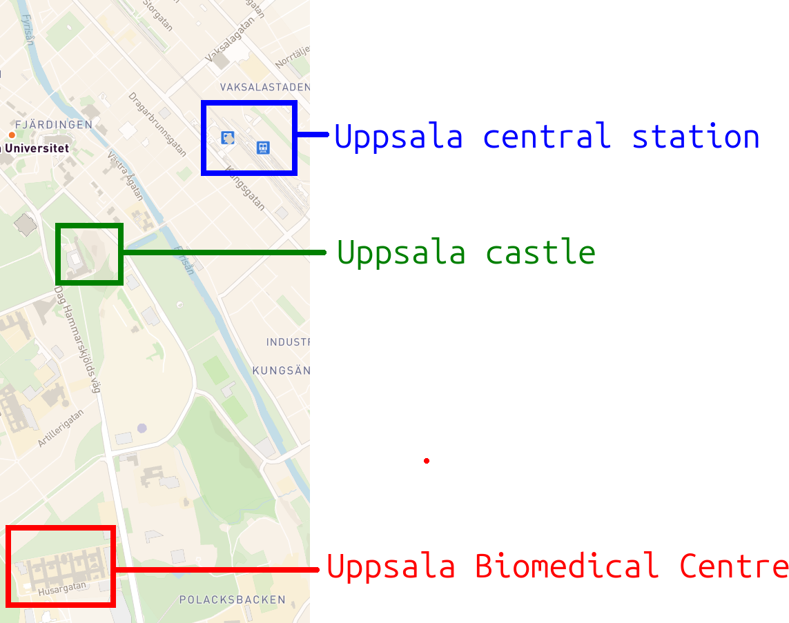
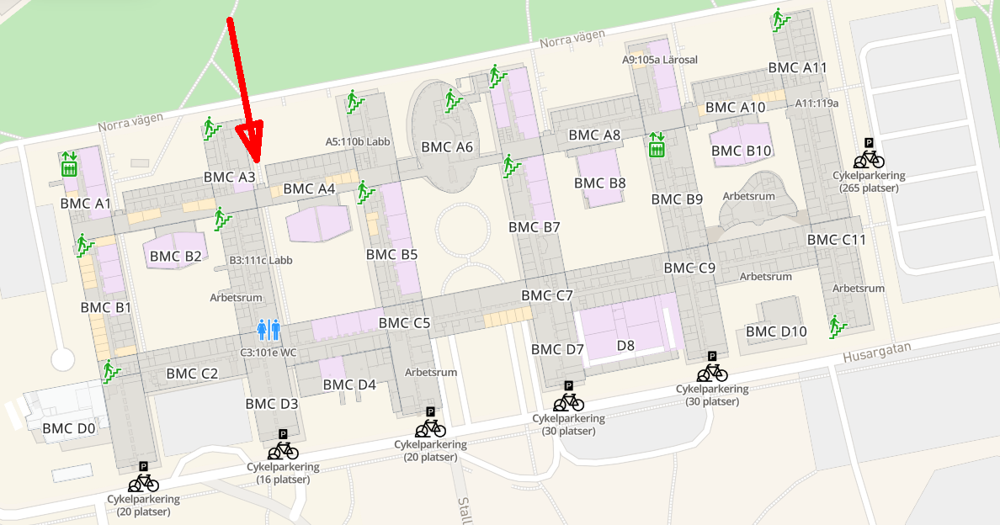
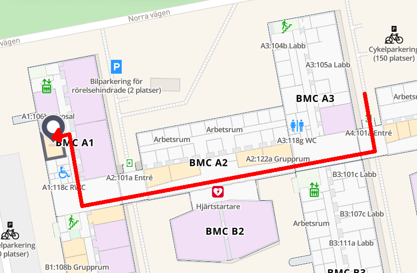

---
tags:
  - location
  - place
  - room
---

# Location

The course takes place at:

```
Uppsala Biomedical Centre (BMC)
Husargatan 3
752 37 Uppsala
```

In the room [A1:112b](http://use.mazemap.com/?v=1&campusid=49&campuses=uu&sharepoitype=identifier&sharepoi=BMC-A1:112b)

## How to get to the Uppsala Biomedical Centre

The Uppsala Biomedical Centre is south of the city center:



It can be reached by the Dag Hammarskölds väg
or the bus stop 'Uppsala Science Park'
([timetables of public transport](https://www.ul.se/reseinfo/tidtabeller2/)).

## How to get to the course room

The easiest way in is via [BMC entrance A4](https://link.mazemap.com/8hLd00Wj):



Then go right, go right again at the end,
after which it is the first room at your right:


