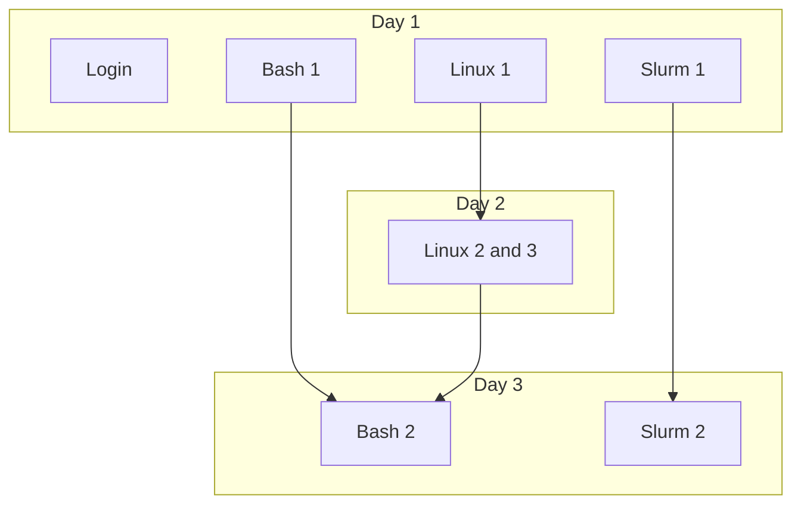

---
tags:
    - lesson
    - UPPMAX
    - intro
    - overview
---

# UPPMAX intro

Here is an overview of [Introduction to UPPMAX](https://docs.uppmax.uu.se/courses_workshops/uppmax_intro_course/):

