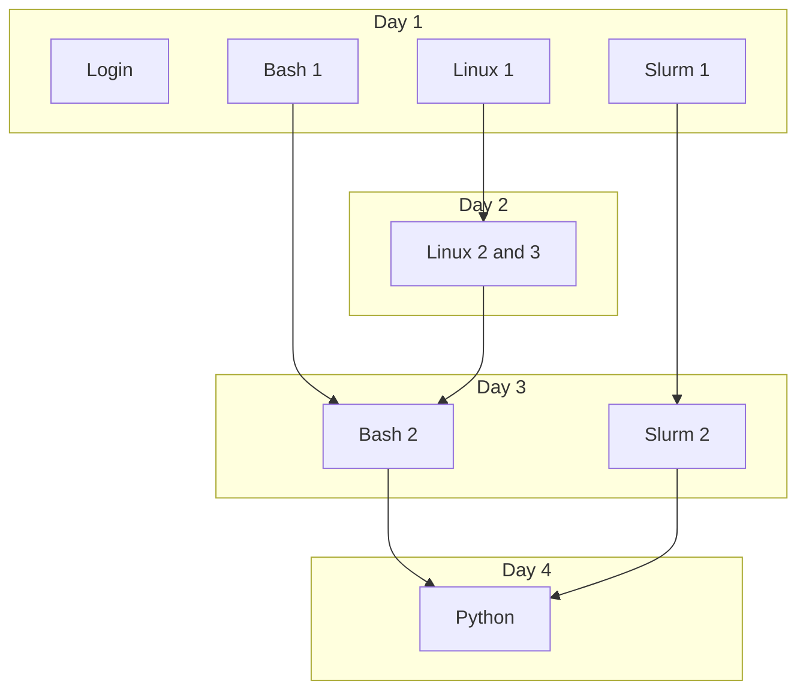

# UPPMAX intro

Day|Link to course material
---|----------------------------------------------------
1  |[here](https://uppmax.github.io/uppmax_intro_day_1)
2  |[Linux II](https://www.uu.se/download/18.57591c9d18f3ec99a0521715/1715115920644/c_560271-l_1-k_uppmax-linux-ii.pptx.pdf) and [Linux III](https://www.uu.se/download/18.57591c9d18f3ec99a0521716/1715115950709/c_560271-l_1-k_uppmax-linux-iii.pptx.pdf)
3  |[Bash scripts](https://www.uu.se/download/18.57591c9d18f3ec99a052171f/1715115979757/c_560271-l_1-k_uppmax-bash-scripts.pptx.pdf) and [Slurm](https://www.uu.se/download/18.57591c9d18f3ec99a0521784/1715116006615/c_560271-l_1-k_uppmax-slurm-2024-01.pdf)
4  |[here](https://github.com/UPPMAX/uppmax_intro_python)
