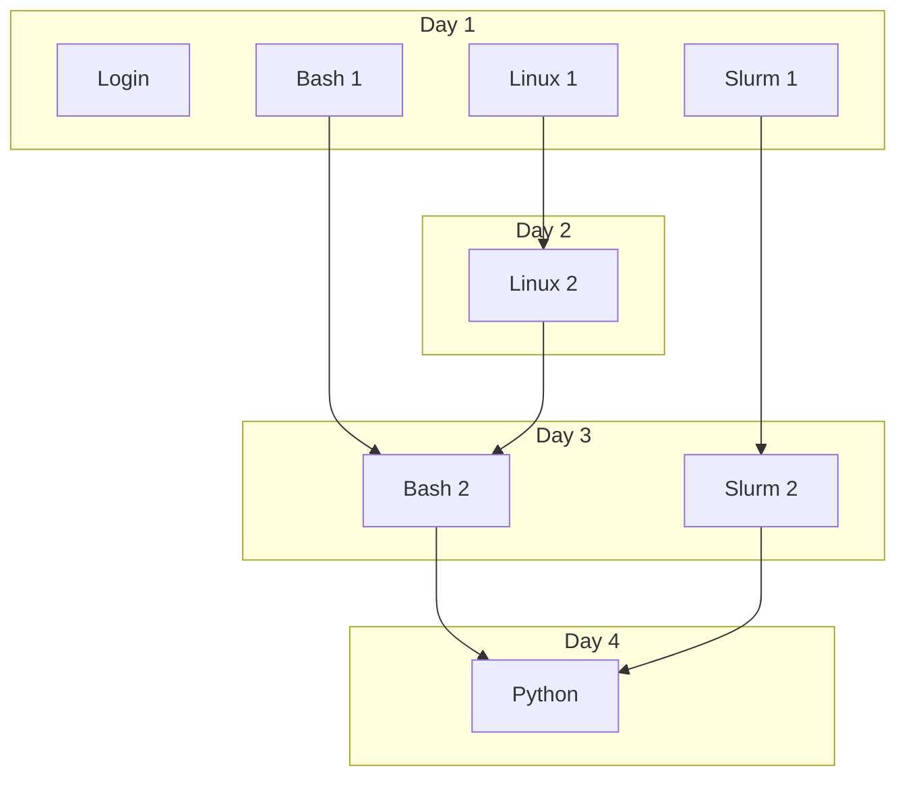

# UPPMAX intro

```mermaid
flowchart TD

  subgraph day_1[Day 1]
    login[Login]
    bash_1[Bash 1]
    slurm_1[Slurm 1]
    linux_1[Linux 1]
  end
  subgraph day_2[Day 2]
    linux_2[Linux 2]
  end
  subgraph day_3[Day 3]
    bash_2[Bash 2]
    slurm_2[Slurm 2]
  end
  subgraph day_4[Day 4]
    python[Python]
  end

  bash_1 --> bash_2
  linux_1 --> linux_2  

  linux_2 --> bash_2
  slurm_1 --> slurm_2

  bash_2 --> python
  slurm_2 --> python
```
