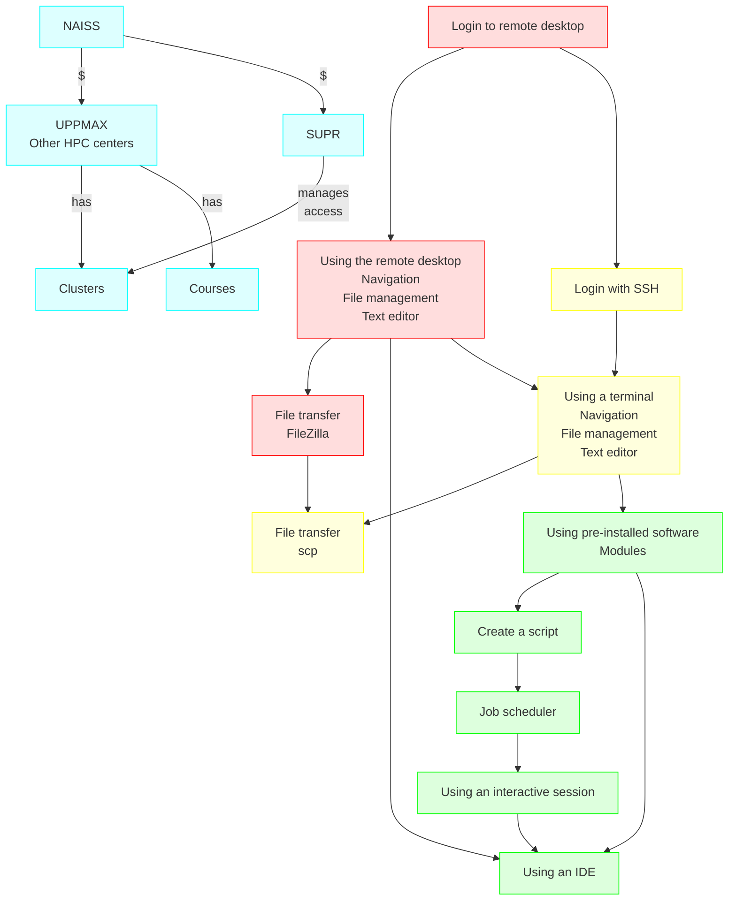
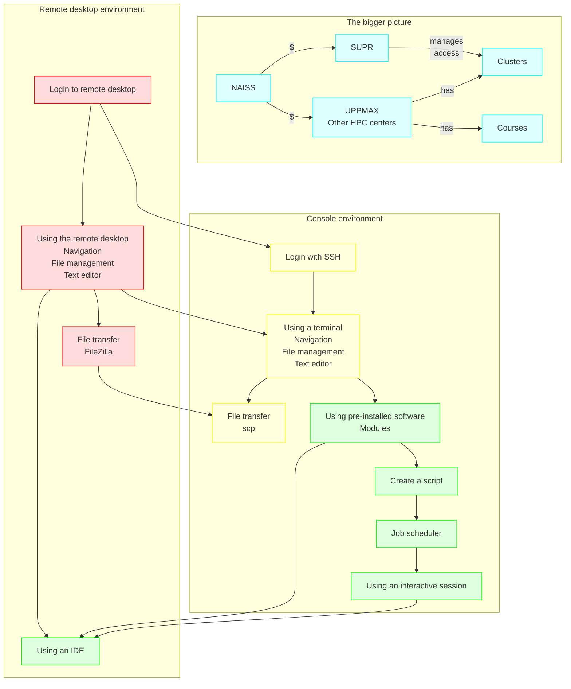
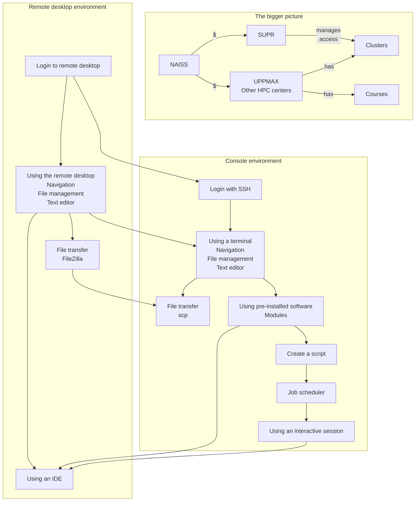

# UPPMAX Intro Day 1

<!-- Indeed, line lengths beyond 80 characters -->
<!-- markdownlint-disable MD013 -->

```mermaid
flowchart TD

  classDef basic_gui fill:#fdd, stroke:#f00
  classDef basic_terminal fill:#ffd, stroke:#ff0
  classDef real_work fill:#dfd, stroke:#0f0
  classDef bigger_picture fill:#dff, stroke:#0ff

  %% subgraph world[The bigger picture]
    naiss[NAISS]:::bigger_picture
    supr[SUPR]:::bigger_picture
    uppmax[UPPMAX\nOther HPC centers]:::bigger_picture
    clusters[Clusters]:::bigger_picture
    courses[Courses]:::bigger_picture
  %% end
  %% subgraph remote_desktop[Remote desktop environment]
    login_remote_desktop[Login to remote desktop]:::basic_gui
    use_remote_desktop[Using the remote desktop\nNavigation\nFile management\nText editor]:::basic_gui
    file_transfer_filezilla[File transfer\nFileZilla]:::basic_gui
    use_ide[Using an IDE]:::real_work
  %% end
  %% subgraph console[Console environment]
    login_ssh[Login with SSH]:::basic_terminal
    use_terminal[Using a terminal\nNavigation\nFile management\nText editor]:::basic_terminal
    file_transfer_scp[File transfer\nscp]:::basic_terminal
    scripts[Create a script]:::real_work
    modules[Using pre-installed software\nModules]:::real_work
    interactive[Using an interactive session]:::real_work
    job_scheduler[Job scheduler]:::real_work
  %% end

  %% Bigger picture
  supr --> |manages\naccess| clusters
  naiss --> |$| uppmax
  naiss --> |$| supr
  uppmax --> |has| clusters
  uppmax --> |has| courses


  %% GUI
  login_remote_desktop ---> use_remote_desktop
  use_remote_desktop --> file_transfer_filezilla
  use_remote_desktop --> use_ide

  %% Console
  login_ssh --> use_terminal
  use_terminal --> file_transfer_scp
  use_terminal --> modules
  scripts --> job_scheduler
  modules --> scripts
  job_scheduler --> interactive

  %% console -> GUI
  modules --> use_ide
  

  %% GUI -> console
  login_remote_desktop --> login_ssh
  use_remote_desktop --> use_terminal
  file_transfer_filezilla --> file_transfer_scp  
  interactive --> use_ide
```

```mermaid
flowchart TD

  classDef basic_gui fill:#fdd, stroke:#f00
  classDef basic_terminal fill:#ffd, stroke:#ff0
  classDef real_work fill:#dfd, stroke:#0f0
  classDef bigger_picture fill:#dff, stroke:#0ff

  subgraph world[The bigger picture]
    naiss[NAISS]:::bigger_picture
    supr[SUPR]:::bigger_picture
    uppmax[UPPMAX\nOther HPC centers]:::bigger_picture
    clusters[Clusters]:::bigger_picture
    courses[Courses]:::bigger_picture
  end
  subgraph remote_desktop[Remote desktop environment]
    login_remote_desktop[Login to remote desktop]:::basic_gui
    use_remote_desktop[Using the remote desktop\nNavigation\nFile management\nText editor]:::basic_gui
    file_transfer_filezilla[File transfer\nFileZilla]:::basic_gui
    use_ide[Using an IDE]:::real_work
  end
  subgraph console[Console environment]
    login_ssh[Login with SSH]:::basic_terminal
    use_terminal[Using a terminal\nNavigation\nFile management\nText editor]:::basic_terminal
    file_transfer_scp[File transfer\nscp]:::basic_terminal
    scripts[Create a script]:::real_work
    modules[Using pre-installed software\nModules]:::real_work
    interactive[Using an interactive session]:::real_work
    job_scheduler[Job scheduler]:::real_work
  end

  %% Bigger picture
  supr --> |manages\naccess| clusters
  naiss --> |$| uppmax
  naiss --> |$| supr
  uppmax --> |has| clusters
  uppmax --> |has| courses


  %% GUI
  login_remote_desktop ---> use_remote_desktop
  use_remote_desktop --> file_transfer_filezilla
  use_remote_desktop --> use_ide

  %% Console
  login_ssh --> use_terminal
  use_terminal --> file_transfer_scp
  use_terminal --> modules
  scripts --> job_scheduler
  modules --> scripts
  job_scheduler --> interactive

  %% console -> GUI
  modules --> use_ide
  

  %% GUI -> console
  login_remote_desktop --> login_ssh
  use_remote_desktop --> use_terminal
  file_transfer_filezilla --> file_transfer_scp  
  interactive --> use_ide
```

```mermaid
flowchart TD

  subgraph world[The bigger picture]
    naiss[NAISS]
    supr[SUPR]
    uppmax[UPPMAX\nOther HPC centers]
    clusters[Clusters]
    courses[Courses]
  end
  subgraph remote_desktop[Remote desktop environment]
    login_remote_desktop[Login to remote desktop]
    use_remote_desktop[Using the remote desktop\nNavigation\nFile management\nText editor]
    file_transfer_filezilla[File transfer\nFileZilla]
    use_ide[Using an IDE]
  end
  subgraph console[Console environment]
    login_ssh[Login with SSH]
    use_terminal[Using a terminal\nNavigation\nFile management\nText editor]
    file_transfer_scp[File transfer\nscp]
    scripts[Create a script]
    modules[Using pre-installed software\nModules]
    interactive[Using an interactive session]
    job_scheduler[Job scheduler]
  end

  %% Bigger picture
  supr --> |manages\naccess| clusters
  naiss --> |$| uppmax
  naiss --> |$| supr
  uppmax --> |has| clusters
  uppmax --> |has| courses


  %% GUI
  login_remote_desktop ---> use_remote_desktop
  use_remote_desktop --> file_transfer_filezilla
  use_remote_desktop --> use_ide

  %% Console
  login_ssh --> use_terminal
  use_terminal --> file_transfer_scp
  use_terminal --> modules
  scripts --> job_scheduler
  modules --> scripts
  job_scheduler --> interactive

  %% console -> GUI
  modules --> use_ide
  

  %% GUI -> console
  login_remote_desktop --> login_ssh
  use_remote_desktop --> use_terminal
  file_transfer_filezilla --> file_transfer_scp  
  interactive --> use_ide
```

<!-- markdownlint-enable MD013 -->
