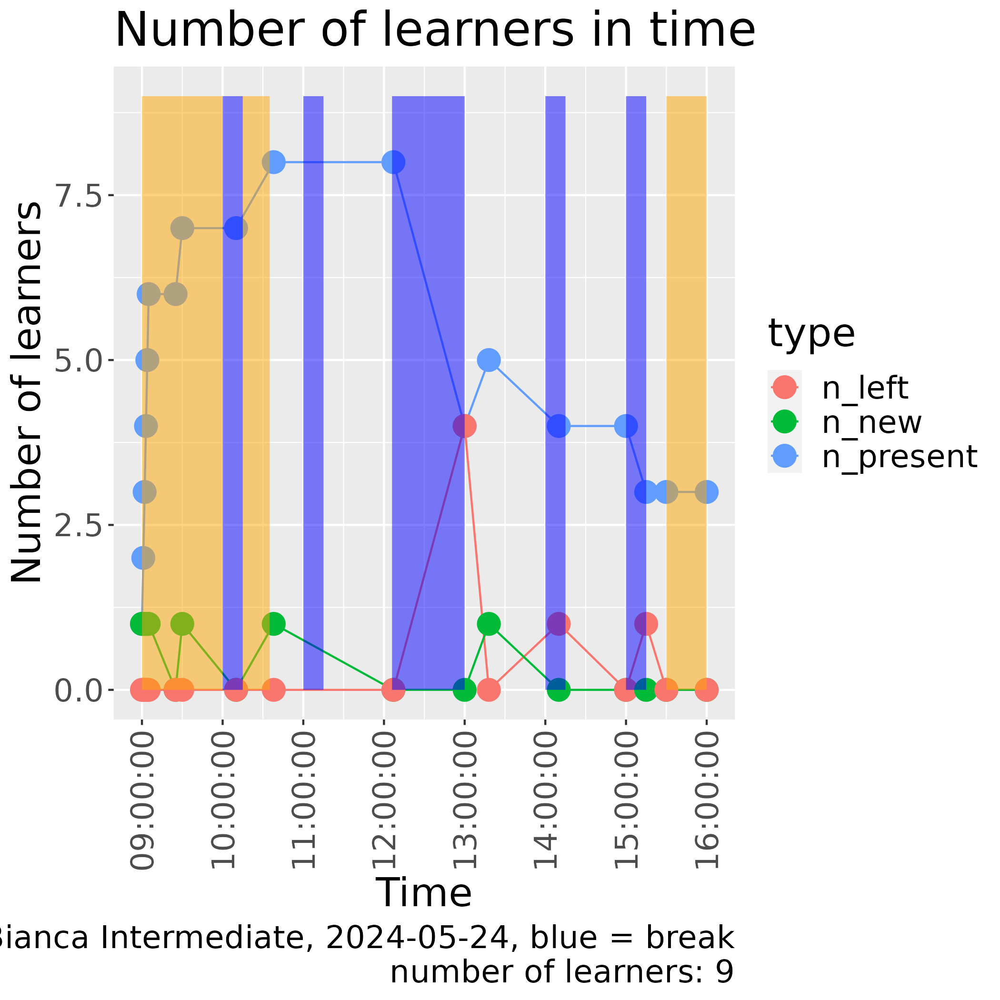

---
tags:
  - reflection
  - 2024-08-27
---

# Reflection 2024-08-27

## Conclusion

- I could keep the 17 learners in well
- All 2 learners that left can be explained, as I encouraged them
- Group size of 3 is good
- Exercise procedure at [as on my website on teaching 'Duo's in Breakout rooms'](https://richelbilderbeek.github.io/teaching/exercise_procedures/duos_in_breakout_rooms/)
  worked well
- Average confidence was 4 out of 5 of all sessions (including sessions we
  did not go through)
- The FileZilla session was weakest, with an average confidence of 4 out of 5
- The evaluation only gave positive feedback

## Reflection

### General

They day went as good as expected.

I am happy how interactive my course was.

### Group sizes and exercise procedure

I decided to use a group size of 3 people and that was
a good decision. I used the standard exercise setup I've
been using
[as on my website on teaching 'Duo's in Breakout rooms'](https://richelbilderbeek.github.io/teaching/exercise_procedures/duos_in_breakout_rooms/).

### Keeping the learners in

Here you can see the amount of learners in time with a camera on/off:

> Learners in my course

Notice how well I was able to maintain having the initial amount of learners
for an online course, even though I encouraged two learners to leave
early (and they did), as they already knew the course's content.

Here are similar plots for other courses:

> Learners in other course

> Learners in another course

> Learners in yet another course

> Learners in yet another course

The learners were quite helpful in helping each other out and I thanked each
of them that did so, especially if they share their screens.

### Time management

There were some learners that finished earlier (i.e. they finished
the exercise of 'interactive', before the other two-thirds of the group
would start it). I took these learners apart and sent them to the evaluation
earlier.

Also, at the start a colleague came into the course to see if he
could help. As things were going smoothly, I encouraged him to
work on other things instead.

### Scheduling

My idea of scheduling was good: I predicted I needed to skip file copying
with `scp`, which I did with the majority of the group (with a small minority
in the main room, we did the exercise and I shortly showed the solution).
We did not reach IDEs, nor did we reach 'The Big Picture'.

To improve:

- [x] In the course schedule, use 'Intro to UPPMAX I' and 'Intro to UPPMAX II',
  as there was 1 learner that thought the same half-day course would be given
  twice
    - Done, as of around 2025-01-20

## Confidences

- For topics I covered: In the course I continued a session if '
  4 out of 5 groups were ready.
  I would expect 80% to have a 4 or 5 ('I have good confidence',
  'I can absolutely do this')
  and 20% to have a 3. If this is lower, I maybe should
  re-evaluate that lesson.
- For topics I did not cover: I ignore this

n|80%
---|---
1|1
2|2
3|3
4|4
5|4
6|5
7|6
8|7
9|8
10|8
11|9
12|10
13|11
14|12
15|12
16|13
17|14

question                                               |answer|n
-------------------------------------------------------|------|---
I can conclude which UPPMAX cluster best suits my needs|0|3
I can conclude which UPPMAX cluster best suits my needs|2|4
I can conclude which UPPMAX cluster best suits my needs|3|2
I can conclude which UPPMAX cluster best suits my needs|4|3
I can conclude which UPPMAX cluster best suits my needs|5|4
I can conclude which UPPMAX cluster best suits my needs|NA|1

Indeed, we did not go over this.

question                                               |answer|n
-------------------------------------------------------|------|---
I can create a bash script|3|1
I can create a bash script|4|5
I can create a bash script|5|11

Threshold: 14. Pass: 16/17

question                                               |answer|n
-------------------------------------------------------|------|---
I can do basic things in the Rackham remote desktop|0|1
I can do basic things in the Rackham remote desktop|2|1
I can do basic things in the Rackham remote desktop|3|1
I can do basic things in the Rackham remote desktop|4|3
I can do basic things in the Rackham remote desktop|5|10
I can do basic things in the Rackham remote desktop|NA|1

Threshold: 13. Pass: 13/16

question                                               |answer|n
-------------------------------------------------------|------|---
I can do basic things in the terminal|4|2
I can do basic things in the terminal|5|15

Threshold: 14. Pass: all

question                                               |answer|n
-------------------------------------------------------|------|---
I can find and load a module|3|1
I can find and load a module|4|3
I can find and load a module|5|13

Threshold: 14. Pass: 16/17

question                                               |answer|n
-------------------------------------------------------|------|---
I can find other UPPMAX courses|1|2
I can find other UPPMAX courses|2|3
I can find other UPPMAX courses|3|3
I can find other UPPMAX courses|4|3
I can find other UPPMAX courses|5|5
I can find other UPPMAX courses|NA|1

Indeed, we did not go over this.

question                                               |answer|n
-------------------------------------------------------|------|---
I can find the hardware specifications of an UPPMAX cluster|0|5
I can find the hardware specifications of an UPPMAX cluster|1|2
I can find the hardware specifications of an UPPMAX cluster|3|4
I can find the hardware specifications of an UPPMAX cluster|4|2
I can find the hardware specifications of an UPPMAX cluster|5|3
I can find the hardware specifications of an UPPMAX cluster|NA|1

Indeed, we did not go over this.

question                                               |answer|n
-------------------------------------------------------|------|---
I can find where to apply for NAISS resources|0|1
I can find where to apply for NAISS resources|1|2
I can find where to apply for NAISS resources|3|5
I can find where to apply for NAISS resources|4|5
I can find where to apply for NAISS resources|5|3
I can find where to apply for NAISS resources|NA|1

Indeed, we did not go over this.

question                                               |answer|n
-------------------------------------------------------|------|---
I can log in to Rackham using a terminal|4|1
I can log in to Rackham using a terminal|5|16

Threshold: 14. Pass: all

question                                               |answer|n
-------------------------------------------------------|------|---
I can log in to the Rackham remote desktop using the website|0|1
I can log in to the Rackham remote desktop using the website|2|1
I can log in to the Rackham remote desktop using the website|3|1
I can log in to the Rackham remote desktop using the website|4|1
I can log in to the Rackham remote desktop using the website|5|12
I can log in to the Rackham remote desktop using the website|NA|1

Threshold: 13. Pass: 13/16

question                                               |answer|n
-------------------------------------------------------|------|---
I can schedule a job|2|1
I can schedule a job|3|1
I can schedule a job|4|3
I can schedule a job|5|12

Threshold: 14. Pass: 15/17

question                                               |answer|n
-------------------------------------------------------|------|---
I can start a terminal text editor|4|4
I can start a terminal text editor|5|13

Threshold: 14. Pass: all

question                                               |answer|n
-------------------------------------------------------|------|---
I can start an IDE|0|7
I can start an IDE|2|2
I can start an IDE|3|3
I can start an IDE|4|1
I can start an IDE|5|3
I can start an IDE|NA|1

Indeed, we did not go over this.

question                                               |answer|n
-------------------------------------------------------|------|---
I can start an interactive session|4|2
I can start an interactive session|5|15

Threshold: 14. Pass: all

question                                               |answer|n
-------------------------------------------------------|------|---
I can transfer files to/from Rackham using FileZilla|0|1
I can transfer files to/from Rackham using FileZilla|2|1
I can transfer files to/from Rackham using FileZilla|3|3
I can transfer files to/from Rackham using FileZilla|4|3
I can transfer files to/from Rackham using FileZilla|5|9

Threshold: 14. Pass: 12. This lesson seems weakest!

Average: (5*9)+(4*3)+(3*3)+(2*1)+(0*1)/17=4.0

question                                               |answer|n
-------------------------------------------------------|------|---
I can transfer files to/from Rackham using `scp`|0|2
I can transfer files to/from Rackham using `scp`|1|1
I can transfer files to/from Rackham using `scp`|3|4
I can transfer files to/from Rackham using `scp`|4|2
I can transfer files to/from Rackham using `scp`|5|8

Only part of the group did this.

I conclude that the FileZilla session was weakest.

## Evaluation results

From the chat:

> 11:30:15 From Nauras Daraghmeh To
> [Teacher] Richèl 'Rea-shell' Bilderbeek(direct message):
> Dont worry, the course material online is really good.
> i am currently going through it.
> i will get myself up to date regarding the basics. [...]

From the survey feedback (5 responses):

- Even though I knew most of the material already as I have been using UPPMAX,
  Day 1 was fun and interactive and I could ask questions and get answers to
  how/why things work, which was nice! Richèl's teaching way is interesting,
  refreshing I would say. He is very friendly and positive with the students
  and addressing the questions/issues. He also makes you think rather than just
  provide the answer so that there is a discussion and this can help with
  remembering what you learn. Overall happy with Day 1.
- It was a really good introduction for beginner level participants.
  Great teaching!
- I really liked that the course started with very basic commands and getting
  to know how to move around in the remote desktop and the terminal.
  I think that the time to do the exercises was sufficient and if needed we
  always got help to overcome any errors occurring. The smaller groups made it
  also easier to help each other and to all manage to be at the same page.
- Thanks a lot for today.
- It was a good course to start using uppmax. The explanations were clear.

From the anonymous feedback (2 responses):

- The course material was very easy to understand and follow.
  The course had a nice pace for beginners
  and Richèl Bilderbeek did a great job!
- Great first day Richèl. Mindful of everyone's time needed for each task.

