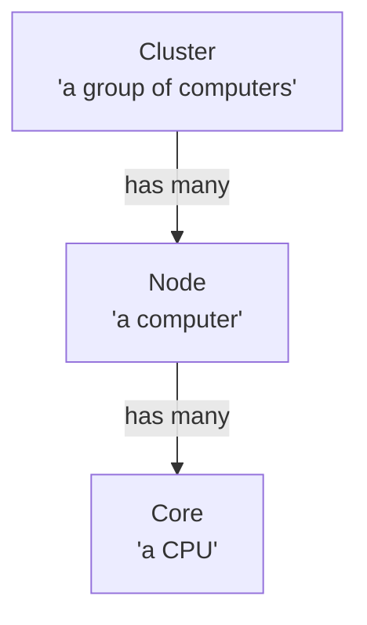
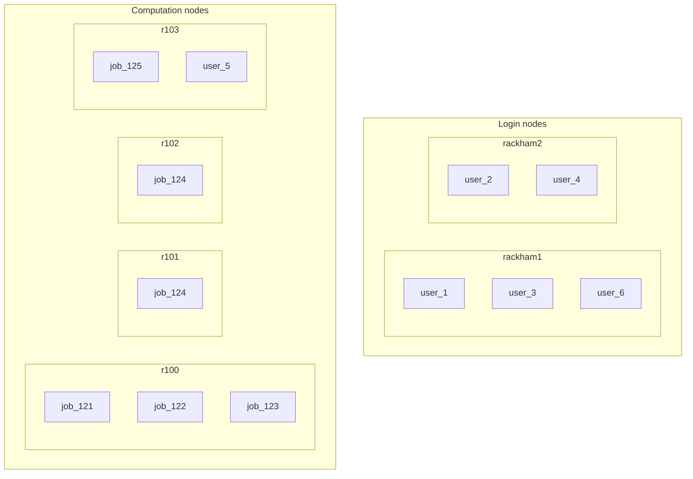

# Clusters

!!!- info "Learning objectives"

    - Understand what a cluster is
    - Understand that a cluster has nodes and that nodes have cores
    - Understand what a job is
    - Understand that a job can use one core, multiple cores and multiple nodes
    - Understand there are two types of nodes
    - Understand to run only light jobs on the login node
    - Understand how to run heavy jobs
    - Understand how to run interactive jobs
    - Understand how to pick an UPPMAX cluster
    - Understand how to find a cluster's hardware specifications

???- question "For teachers"

    Prerequisites are:

    - [...]

    Preparations are:

    - [...]

    Teaching goals are:

    - [...]


    Lesson plan:

    ```mermaid
    gantt
      title Something
      dateFormat X
      axisFormat %s
      section First hour
      Course introduction: done, course_intro, 0, 10s
      Prior : intro, after course_intro, 5s
      Present: theory_1, after intro, 5s
      Challenge: crit, exercise_1, after theory_1, 40s
      Break: crit, milestone, after exercise_1
      section Second hour
      Challenge: crit, exercise_2, 0, 10s
      Feedback: feedback_2, after exercise_2, 10s
      SLURM: done, slurm, after feedback_2, 25s
      Break: done, milestone, after slurm
    ```

    Prior questions:

    - [...]

## Why?

Clusters are complex machines.
Understanding the basics of what a cluster is,
helps us understand why the are the way they are.

## What is a cluster?

A (computer) cluster is a group of computers working together.
A cluster is shared by many users, 
that have widely different demands.
Different users need different software
and -for the same software!- possibly different versions.

## When to use a cluster?

- Calculations take too long
- Calculations require too much memory
- Calculations require too much disk space
- Any combination of the above

## UPPMAX clusters

These are the most important UPPMAX clusters for us:

Name   |Purpose
-------|---------------
Bianca |Sensitive data
Rackham|General purpose
Snowy  |Provides GPUs

- [System usage](https://www.uppmax.uu.se/resources/system-usage/)
- [Other clusters](https://www.uu.se/en/centre/uppmax/resources/clusters)
- [Storage systems](https://www.uu.se/en/centre/uppmax/resources/storage)

## Cluster architecture

A (computer) cluster is a group of computers working together.
Each of those computers is called a node.
Each node has, among others, several CPUs (called 'cores') and RAM.



Each core can run a calculation.
A calculation is called a job.
A job can use one core, multiple cores or multiple nodes.
One special job is an interactive session,
in which a user can interactively start hard calculations on a compute node.

There are two types of nodes:

- login node: a nodes that is shared by multiple users,
  which allows to do lightweight things,
  such as scheduling a hard calculation
- compute node: a node that is scheduled for hard calculations
  or individual interactive use.



> A simplified view of Rackham.
> The login node `rackham1` has three users on it.
> The login node `rackham2` has two users on it.
> The compute node `r100` is running three different jobs.
> The compute nodes `r101` and `r102` are running the same job.
> The compute node `r103` is used for an interactive job by `user_5`.

## Exercises

[...]

### Exercise 1: Understand

!!!- info "Learning objectives"

    - [...]


### (optional) Exercise 2: Understand system usage

Go to [https://status.uppmax.uu.se/usage/](https://status.uppmax.uu.se/usage/).

- Why are there three systems?	
- Which system has the most cores?
- Which system has the least cores?
- Can we see a difference between a regular weekday and weekends?
- Can we see a difference between a working hours and the other hours?

### (optional) Exercise 3: Find hardware specifications

- Pick your favorite UPPMAX cluster
- Read the doc
- Find the hardware specifications of this cluster

