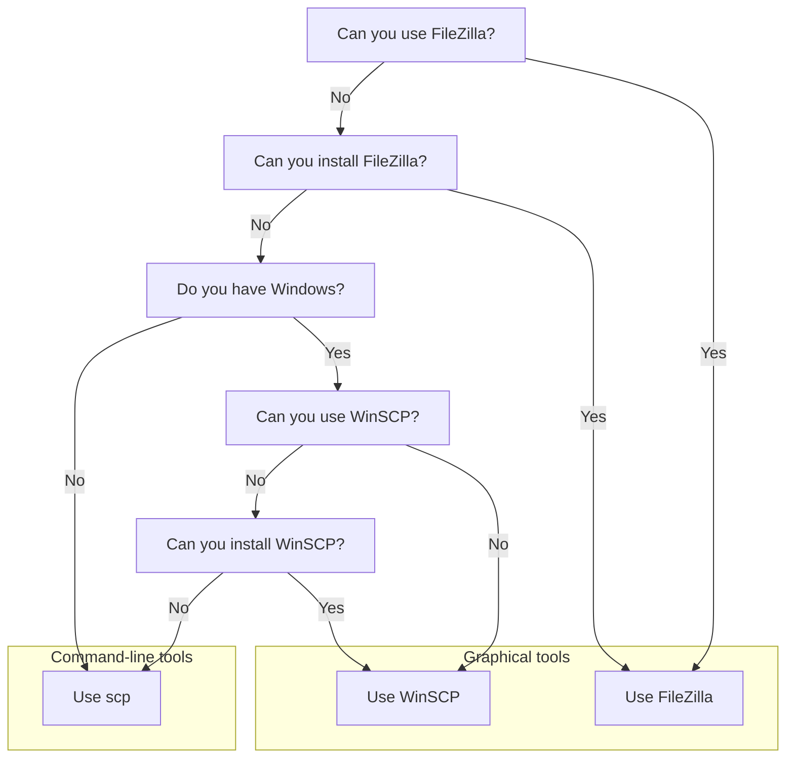

---
tags:
    - lesson
    - file
    - data
    - transfer
    - FileZilla
    - GUI
    - graphical
    - WinSCP
---

# File transfer using a graphical tool

!!!- info "Learning outcomes"

    - Practice using the UPPMAX documentation
    - Can transfer files using a graphical tool

???- question "For teachers"

    Teaching goals are:

    - Learners have practiced using the UPPMAX documentation
    - Learners have transferred files using a graphical tool

    Lesson plan:

    ```mermaid
    gantt
      title File transfer using FileZilla
      dateFormat X
      axisFormat %s
      section First hour
      Prior : prior, 0, 5s
      Present: present, after prior, 2s
      %% It took me 7 mins, here I do that time x2
      Challenge: crit, challenge, after present, 14s
      Feedback: feedback, after challenge, 7s
    ```

    Prior questions:

    - What is a file tranfer?
    - How can one do a file transfer?
    - Can you name some programs that can do file transfer?
    - Who has heard of FileZilla?
    - Who has already used FileZilla?


> FileZilla being able to do file transfer to/from Pelle

## Why?

Fairly sure you'll want to upload or download files to Pelle.
Here we do so.

## Exercises

???- question "Need a video?"

    <!-- markdownlint-disable MD013 --><!-- Tables cannot be split up over lines, hence will break 80 characters per line -->

    Tool     |YouTube video
    ---------|----------------------------------------------------------------------------------------------------
    FileZilla|[File transfer to/from Pelle using FileZilla](https://www.youtube.com/watch?v=NOHYNj1vW28)
    WinSCP   |None available
    `scp`    |TODO

    <!-- markdownlint-enable MD013 -->

## Exercise 1: which tool?

Take a look at this decision tree:



Here is the same information in a table:

<!-- markdownlint-disable MD013 --><!-- Tables cannot be split up over lines, hence will break 80 characters per line -->

Tool     |Homepage                                    |Operating systems(s)  |Interface|Description
---------|--------------------------------------------|----------------------|---------|----------------------------------------
FileZilla|[Homepage](https://filezilla-project.org/)  |Linux, Mac and Windows|Graphical|Recommended if it can be used
WinSCP   |[Homepage](https://winscp.net/eng/index.php)|Windows               |Graphical|Popular Windows alternative to FileZilla
`scp`    |Part of your SSH client                     |Linux, Mac and Windows|Terminal |Always works

<!-- markdownlint-enable MD013 -->

- Pick the best file transfer tool at your disposal.
- If needed and possible: install that tool, as documented on its homepage
- Use [the UPPMAX documentation](http://docs.uppmax.uu.se/) to upload
  and download a file

<!-- markdownlint-disable MD013 --><!-- Tables cannot be split up over lines, hence will break 80 characters per line -->

Tool     |UPPMAX documentation page
---------|----------------------------------------------------------------------------------------------------
FileZilla|[UPPMAX documentation page](https://docs.uppmax.uu.se/software/pelle_file_transfer/)
WinSCP   |[UPPMAX documentation page](https://docs.uppmax.uu.se/software/pelle_file_transfer_using_winscp/)
`scp`    |[UPPMAX documentation page](https://docs.uppmax.uu.se/software/pelle_file_transfer_using_scp/)

<!-- markdownlint-enable MD013 -->
