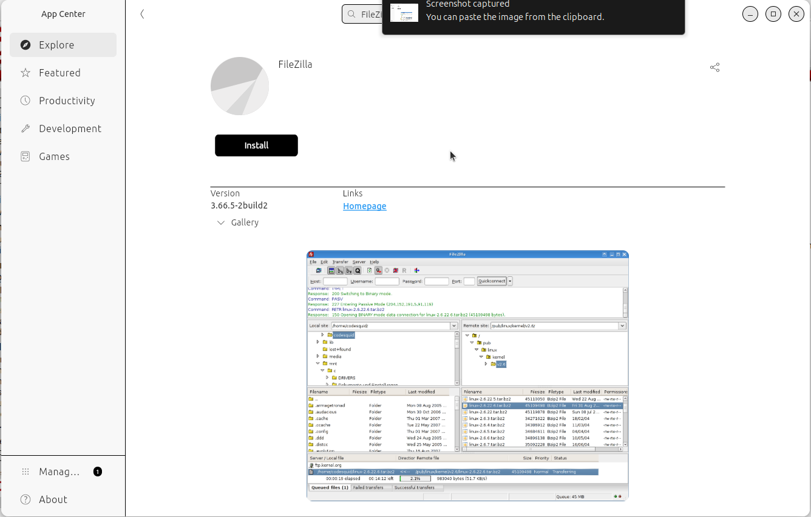

# File transfer using FileZilla

!!!- info "Learning objectives"

    - Practice using the UPPMAX documentation
    - Can install FileZilla
    - Can transfer files using FileZilla 

???- question "For teachers"

    Teaching goals are:

    - Learners have practiced using the UPPMAX documentation
    - Learners have installed FileZilla
    - Learners have transferred files using FileZilla 

    Lesson plan:

    ```mermaid
    gantt
      title Something
      dateFormat X
      axisFormat %s
      section First hour
      Course introduction: done, course_intro, 0, 10s
      Prior : intro, after course_intro, 5s
      Present: theory_1, after intro, 5s
      Challenge: crit, exercise_1, after theory_1, 40s
      Break: crit, milestone, after exercise_1
      section Second hour
      Challenge: crit, exercise_2, 0, 10s
      Feedback: feedback_2, after exercise_2, 10s
      SLURM: done, slurm, after feedback_2, 25s
      Break: done, milestone, after slurm
    ```

    Prior questions:

    - What is a file tranfer?
    - How can one do a file transfer?
    - Can you name some programs that can do file transfer?
    - Who has heard of FileZilla?
    - Who has already used FileZilla?


> FileZilla being able to do file transfer to/from Rackham

## Why?

Fairly sure you'll want to upload or download files to Rackham.
Here we do so.

We use a free and open-source graphical tool to do this,
called FileZilla.
It works under Linux, Mac and Windows.

## Exercises

### Exercise 1: install FileZilla

Install FileZilla.

Under Ubuntu, you can can use the Ubuntu App Center.

???- question "How does the Ubuntu App Center look like?"

    Here:

    

For non-Ubuntu users, search the web, download and install.

???- question "Answer"

    The FileZilla website can be found at <https://filezilla-project.org/>.

    Clicking on 'Download FileZilla client' takes you to the
    FileZilla download page at <https://filezilla-project.org/download.php?type=client>.

    Download the file, maybe unzip it and run the installer

### Exercise 2: transfer a file

Use [the UPPMAX documentation](http://docs.uppmax.uu.se/)
for help.

- Search for the procedure on how to transfer a file
  to/from Rackham using FileZilla

???- question "Answer"

    The procedure can be found at <https://docs.uppmax.uu.se/software/rackham_file_transfer_using_filezilla/>.

- Follow that procedure to transfer a file
- Use the file explorer to verify that files indeed are transferred
