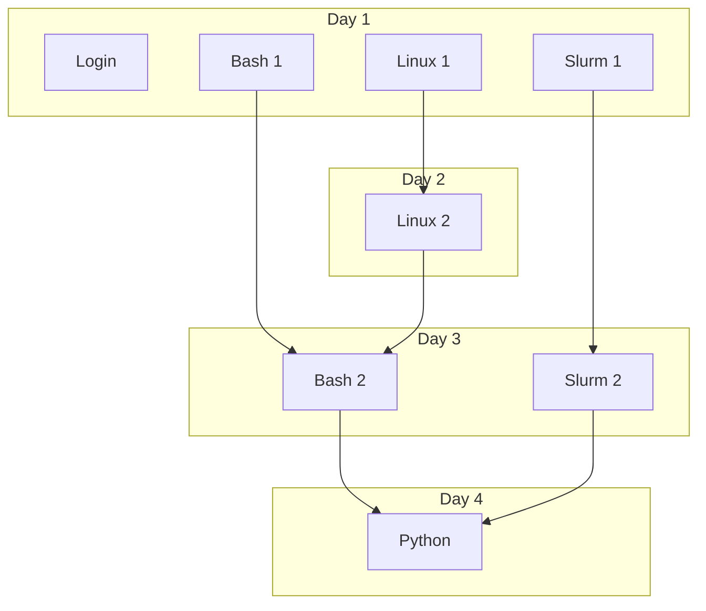

# Introduction

!!!- info "Learning objectives"

    - Understand today in the big picture
    - [CONVERT THE ONES BELOW]
    - Get overview of UPPMAX and NAISS
    - Work with your files in a LINUX environment
    - Learn to use the UPPMAX resources in a good way
    - Learn the basics in the Python programming language
    - Let's step up and have an overview of SNIC
    - This is a short introduction in how to reach the calculation nodes
    - Wednesday afternoon is wedded to this topic!
    - We'll get an overview of UPPMAX and SNIC/NAISS and how a computer cluster works
    - Let's recap and go a little deeper into the organization of NAISS/UPPMAX
    - Let's step up and have an overview of NAISS
    - We'll relate our login session to the specific "area" in the cluster.
    - We'll go through platform specific (Mac/Linux/Windows) ways to log in to UPPMAX.
    - We'll briefly get an overview of Linux
      - How the command line works
      - Some text editors
      - Things to be aware of
    - Let's dig into the most important BASH commands
    - We'll do a type-along session
    - Get overview of UPPMAX and NAISS
    - Work with your files in a LINUX environment
    - Learn to use the UPPMAX resources in a good way
    - Learn the basics in the Python programming language
    - Let's recap and go a little further into the UPPMAX hardware!
    - We'll briefly get an overview of kinds of sensitive data
    - ... and the **Bianca** system

## UPPMAX intro overview

## Today

When       |Who|What
-----------|---|-----------------
??:??-??:??|R  |[Login](login.md)

Linux
HPC
NAISS
Software
- modules
Submitting jobs
Working on UPPMAX
Courses and workshops
NAISS Sens and Bianca
File transfer
Using an IDE
