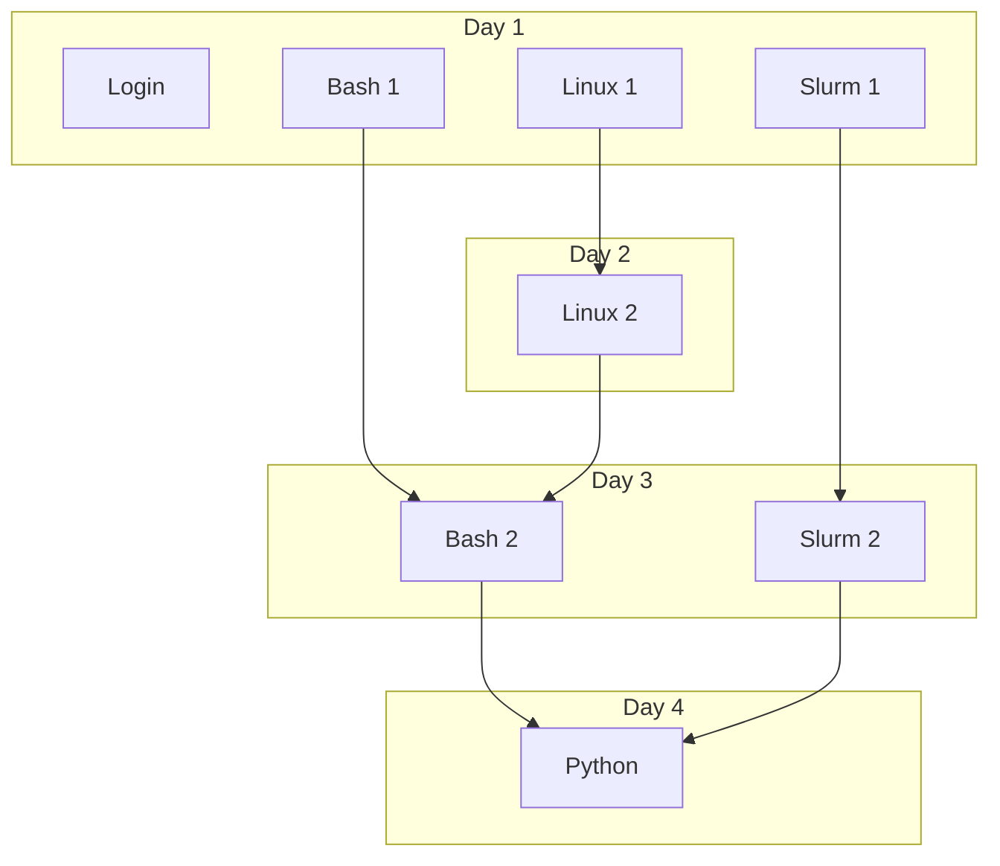
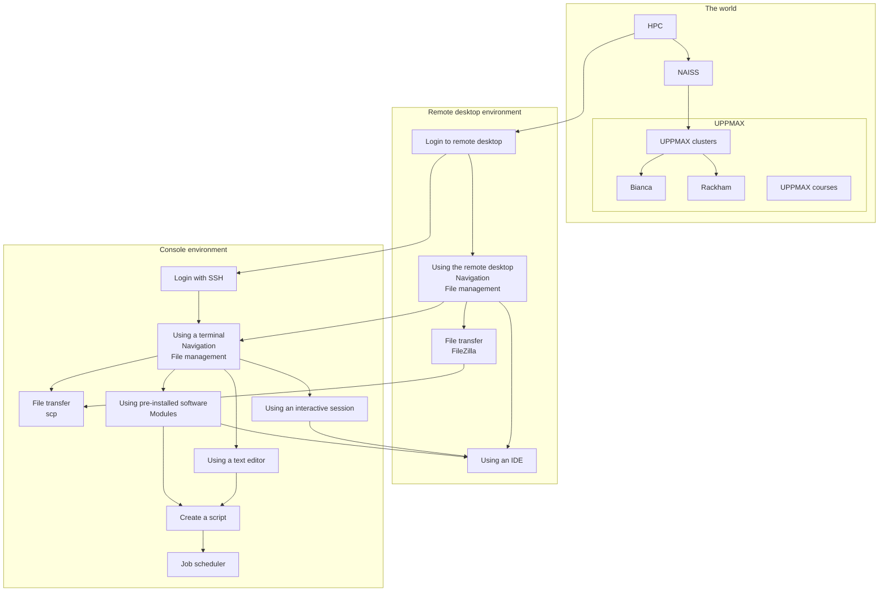

# Introduction

!!!- info "Learning objectives"

    - Understand the role of this day in this four day course
    - Understand where the find the schedule
    - Understand the topics of today
    - [CONVERT THE ONES BELOW]
    - Get overview of UPPMAX and NAISS
    - Get overview of UPPMAX and NAISS
    - Let's step up and have an overview of SNIC
    - Let's step up and have an overview of NAISS
    - Let's recap and go a little deeper into the organization of NAISS/UPPMAX
    - Work with your files in a LINUX environment
    - We'll relate our login session to the specific "area" in the cluster.
    - We'll go through platform specific (Mac/Linux/Windows) ways to log in to UPPMAX.
    - We'll briefly get an overview of Linux
      - How the command line works
      - Some text editors
      - Things to be aware of
    - Let's dig into the most important BASH commands
    - Let's recap and go a little further into the UPPMAX hardware!
    - We'll briefly get an overview of kinds of sensitive data
    - ... and the **Bianca** system

## UPPMAX intro overview

## Overview of today

## Today

When       |Who|What
-----------|---|-----------------
??:??-??:??|R  |[Clusters](clusters.md)
??:??-??:??|R  |[Login](login.md)
??:??-??:??|R  |[Log in to remote desktop environment](login_remote_desktop.md)
??:??-??:??|R  |[Using the remote desktop environment](use_remote_desktop.md)
??:??-??:??|R  |[File transfer using FileZilla](file_transfer_using_filezilla.md)
??:??-??:??|R  |[Log in to console environment](login_console.md)
??:??-??:??|R  |[Using a terminal](use_terminal.md)
??:??-??:??|R  |[File transfer using scp](file_transfer_using_scp.md)
??:??-??:??|R  |[The module system](modules.md)
??:??-??:??|R  |[Using an IDE](ide.md)
??:??-??:??|R  |[Using a text editor](text_editor.md)
??:??-??:??|R  |[Creating a bash script](scripts.md)
??:??-??:??|R  |[The job scheduler](slurm.md)
??:??-??:??|R  |[The UPPMAX clusters](uppmax_clusters.md)
??:??-??:??|R  |[The UPPMAX Rackham cluster](rackham.md)
??:??-??:??|R  |[The UPPMAX Bianca cluster](bianca.md)
??:??-??:??|R  |[HPC](hpc.md)
??:??-??:??|R  |[NAISS](naiss.md)
??:??-??:??|R  |[Getting started, apply for UPPMAX resources](getting_started.md)
??:??-??:??|R  |[Courses](courses.md)
