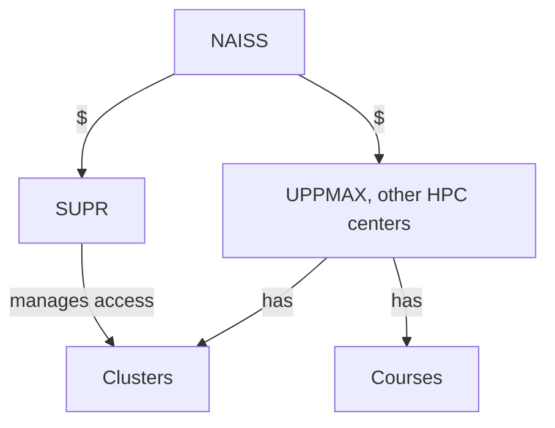

---
tags:
    - lesson
    - bigger picture
---

# The bigger picture

Here we go look at the bigger picture.

<!-- markdownlint-disable MD013 --><!-- Tables cannot be split up over lines, hence will break 80 characters per line -->

| Link                                | Description                                |
| ----------------------------------- | ------------------------------------------ |
| [NAISS](../sessions/naiss.md)       | Request for NAISS resources                |
| [Clusters](../sessions/clusters.md) | Clusters in general and specific to UPPMAX |
| [Courses](../sessions/courses.md)   | Courses in general and specific to UPPMAX  |

<!-- markdownlint-enable MD013 -->
