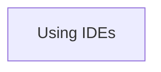

# Going deeper

Here we go a bit deeper.

The session on the job scheduler is considered so important to us,
that there will be a full day dedicated to it.
Today, however, we will use it minimally.

Link                                                                          |Description
------------------------------------------------------------------------------|--------------------------------------------------------------------------
[IDEs](../sessions/ides.md)                                                   |Use an IDE
