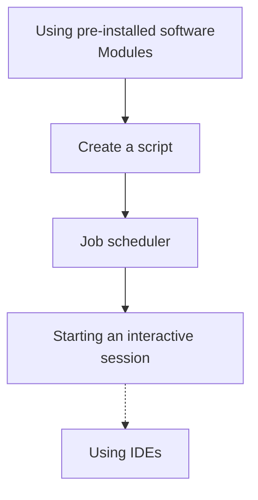

# Doing real work

Here we start doing real work: setting Rackham to work!

The session on the job scheduler is considered so important to us,
that there will be a full day dedicated to it.
Today, however, we will use it minimally.

Link                                                                          |Description
------------------------------------------------------------------------------|--------------------------------------------------------------------------
[Modules](../sessions/modules.md)                                             |Find and load software modules
[Scripts](../sessions/scripts.md)                                             |Create scripts
[Job scheduler](../sessions/job_scheduler.md)                                 |Send jobs to the scheduler
[Starting an interactive session](../sessions/start_interactive_session.md)   |Starting an interactive session
[IDEs](../sessions/ides.md)                                                   |Use an IDE

