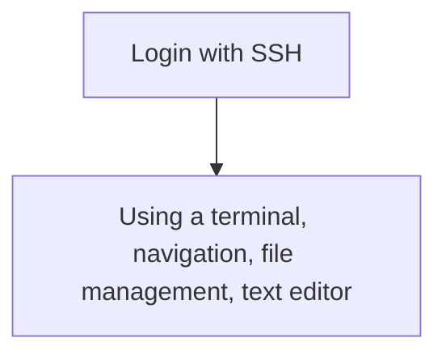

---
tags:
    - lesson
    - terminal
    - basic
    - terminal
    - use
    - console
    - command-line
---

# Basic use from a terminal

Here we start using Pelle from a terminal.
To ease the learning curve,
we first do things you've already done
with visual tools.

<!-- Indeed, line lengths beyond 80 characters -->
<!-- markdownlint-disable MD013 -->

| Link                                            | Description                                                                |
| ----------------------------------------------- | -------------------------------------------------------------------------- |
| [Login with SSH](../sessions/login_console.md)  | Log in to Pelle's console environment                                    |
| [Using a terminal](../sessions/use_terminal.md) | Using a terminal for exploring the filesystem and do basic file management |

<!-- markdownlint-enable MD013 -->
