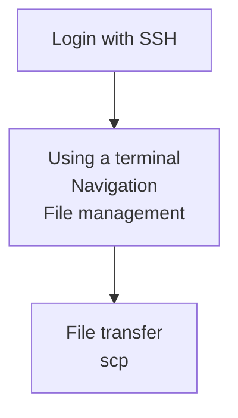

# Basic use from a terminal

Here we start using Rackham from a terminal.
To ease the learning curve,
we first do things you've already done
with visual tools.

Link                                                                          |Description
------------------------------------------------------------------------------|--------------------------------------------------------------------------
[Login with SSH](../sessions/login_console.md)                                |Log in to Rackham's console environment
[Using a terminal](../sessions/use_terminal.md)                               |Using a terminal for exploring the filesystem and do basic file management
[File transfer using SCP](../sessions/file_transfer_using_scp.md)             |Tranfer files from the terminal
