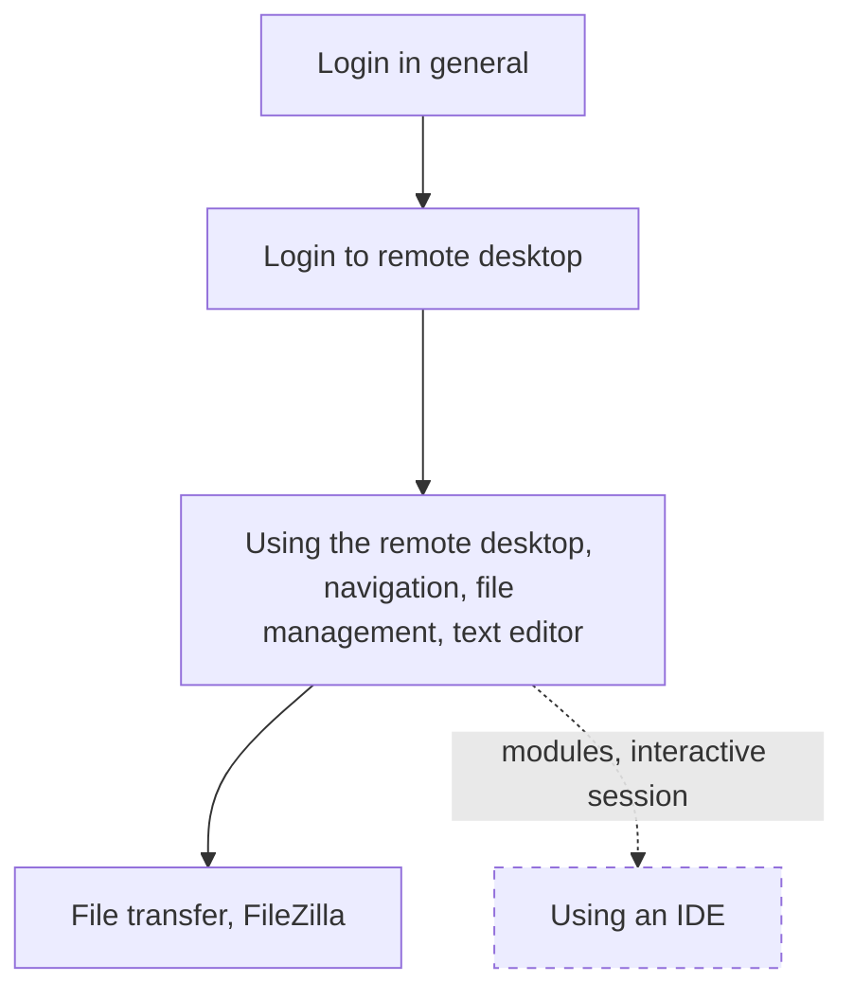

# Basic use with visual tools introduction

Here we start using Rackham.
To ease the learning curve, we use software that is visual,
so you can start feeling at home on Rackham,
before moving to more abstract new topics.

We will not yet discuss IDEs (whatever those are) yet,
as it requires using techniques we teach later.

<!-- Indeed, line lengths beyond 80 characters -->
<!-- markdownlint-disable MD013 -->

Link                                                                          |Description
------------------------------------------------------------------------------|---------------------------
[Login](../sessions/login.md)                                                 |Log in to an UPPMAX cluster
[Log in to remote desktop environment](../sessions/login_remote_desktop.md)   |Log in to the Rackham remote desktop environment via the website
[Using the remote desktop environment](../sessions/use_remote_desktop.md)     |Using a remote desktop environment
[File transfer using FileZilla](../sessions/file_transfer_using_filezilla.md) |File transfer using FileZilla

<!-- markdownlint-enable MD013 -->
