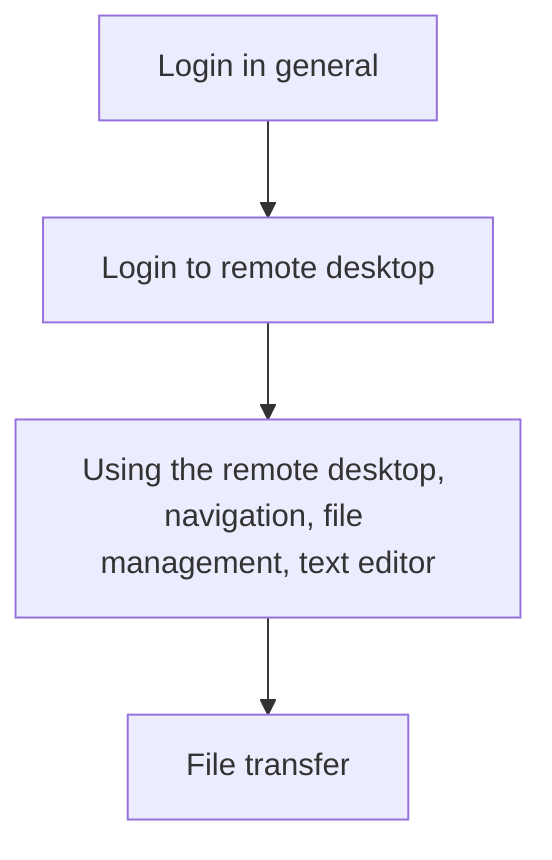

---
tags:
    - lesson
    - visual tools
    - introduction
    - overview
---

# Basic use with visual tools introduction

> I really liked that the course started with very basic commands and
> getting to know how to move around in the remote desktop and the terminal.
>
> A learner in this course ([source](../evaluations/20240827/README.md))

Here we start using Pelle.
To ease the learning curve, we use software that is visual,
so you can start feeling at home on Pelle,
before moving to more abstract new topics.

<!-- Indeed, line lengths beyond 80 characters -->
<!-- markdownlint-disable MD013 -->

| Link                                                                          | Description                                                      |
| ----------------------------------------------------------------------------- | ---------------------------------------------------------------- |
| [Login](../sessions/login.md)                                                 | Log in to an UPPMAX cluster                                      |
| [Log in to remote desktop environment](../sessions/login_remote_desktop.md)   | Log in to the Pelle remote desktop environment via the website   |
| [Using the remote desktop environment](../sessions/use_remote_desktop.md)     | Using a remote desktop environment                               |
| [File transfer](../sessions/file_transfer.md)                                 | File transfer                                                    |

<!-- markdownlint-enable MD013 -->
