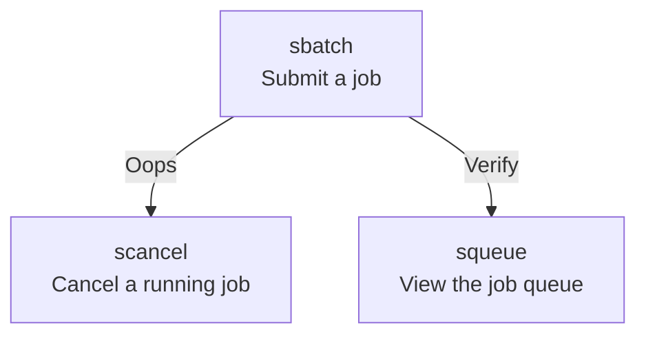
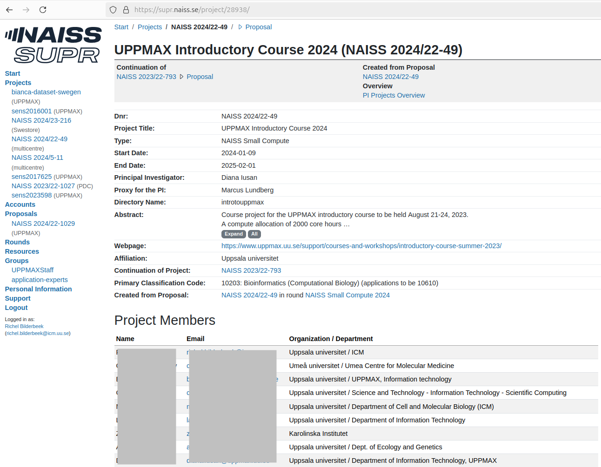

# The job scheduler

!!!- info "Learning objectives"

    - Practice using the UPPMAX documentation
    - Can find his/her NAISS/UPPMAX projects
    - Can see the job queue
    - Can submit a job from the command line
    - Can submit a job using a script
    - Can cancel a job

???- question "For teachers"

    Teaching goals are:

    - Learners have practiced using the UPPMAX documentation
    - Learners can find their NAISS/UPPMAX projects
    - Learners can see the job queue
    - Learners can submit a job from the command line
    - Learners can submit a job using a script
    - Learners can cancel a job

    Lesson plan:

    ```mermaid
    gantt
      title Something
      dateFormat X
      axisFormat %s
      section First hour
      Course introduction: done, course_intro, 0, 10s
      Prior : intro, after course_intro, 5s
      Present: theory_1, after intro, 5s
      Challenge: crit, exercise_1, after theory_1, 40s
      Break: crit, milestone, after exercise_1
      section Second hour
      Challenge: crit, exercise_2, 0, 10s
      Feedback: feedback_2, after exercise_2, 10s
      SLURM: done, slurm, after feedback_2, 25s
      Break: done, milestone, after slurm
    ```

    Prior questions:

    - What is a job?
    - What is a job scheduler?
    - Why does one need a job scheduler?
    - What information may one need to tell a job scheduler?
    - Is it possible to have all nodes of Rackham running your jobs?

## Why?

You want to do calculations that take a long time and use much CPU
power. To do so, one needs to schedule these jobs!

This is a short introduction in how to reach the calculation nodes
Wednesday afternoon is wedded to this topic!

## Using the job scheduler

The job scheduler has multiple programs,
we use a minimal set of these three:



## Exercises

### Exercise 1: see the job queue

Go to the UPPMAX documentation at
[https://docs.uppmax.uu.se](https://docs.uppmax.uu.se),
then answer these questions:

- Find the page on `squeue`, the program to view the job queue

???- question "Answer"

    It can be found at <https://docs.uppmax.uu.se/software/squeue/>

- View all jobs in the queue

???- question "Answer"

    View all jobs in the queue:

    ```bash
    squeue
    ```

- View all your jobs in the queue

???- question "Answer"

    View your jobs in the queue:

    ```bash
    squeue -u $USER
    ```

    You will probably see that you have zero jobs scheduled

### Exercise 2: view my UPPMAX projects

Go to the UPPMAX documentation at
[https://docs.uppmax.uu.se](https://docs.uppmax.uu.se),
then answer these questions:

- Find the UPPMAX documentation page about projects

???- question "Answer"

    It can be found at <https://docs.uppmax.uu.se/getting_started/project/>

- Where does that page redirect you, to view your projects?

???- question "Answer"

    You are redirected to the SUPR NAISS page at <https://supr.naiss.se/>

- View all your projects

???- question "Answer"

    Here is an example of a user's SUPR projects

    

- View the project of this course

???- question "Answer"

    Here is how it looks like:

    

### Exercise 3: submit a minimal job with Slurm parameters in the command-line

Go to the UPPMAX documentation at
[https://docs.uppmax.uu.se](https://docs.uppmax.uu.se),
then answer these questions:

- Create a minimal bash script that does something.
  It may or may not use a module.
  It does need a shebang (but go ahead and omit it to see which error occurs)!

???- question "Answer"

    A minimal bash script would be:

    ```bash
    #!/bin/bash
    echo "Hello"
    ```

    But any valid bash script with the same first line will do.


- Find the page on `sbatch`, the program to submit a job to the queue

???- question "Answer"

    It can be found at <https://docs.uppmax.uu.se/software/sbatch/>

- Use `sbatch` to submit running your bash script to the queue

???- question "Answer"

    Submit your script to the job queue like this:

    ```bash
    sbatch -A naiss2024-22-49 my_script.sh
    ```

???- question "How does that look like?"

    Your output will look similar to this:

    ```bash
    [sven@rackham3 ~]$ sbatch -A naiss2024-22-49 my_script.sh
    Submitted batch job 49309848
    ```

    The number is your job number

???- question "I get an error: 'This does not look like a batch script'"

    Like stated at the start of this exercise, the bash script
    needs to have a shebang. 

    Running a script without a shebang such as this:

    ```bash
    module load cowsay/3.03
    cowsay hello
    ```

    Will result in the following error:

    <!-- Indeed, line lengths beyond 80 characters -->
    <!-- markdownlint-disable MD013 -->

    ```bash
    [sven@rackham3 ~]$ sbatch -A naiss2024-22-49 my_script.sh
    sbatch: error: This does not look like a batch script.  The first
    sbatch: error: line must start with #! followed by the path to an interpreter.
    sbatch: error: For instance: #!/bin/sh
    ```

    <!-- markdownlint-enable MD013 -->

- Use `squeue` to confirm that your job is in the job queue.
  You may need to be fast to see it!

???- question "Answer"

    The easiest is:

    ```bash
    squeue -u $USER
    ```

    Because the job may finish very fast, a trick is to use a semicolon
    to run the two command directly after each other:

    ```bash
    sbatch -A naiss2024-22-49 my_script.sh; squeue -u $USER
    ```

    The output will be similar to:

    <!-- Indeed, line lengths beyond 80 characters -->
    <!-- markdownlint-disable MD013 -->

    ```bash
    [richel@rackham3 ~]$ sbatch -A naiss2024-22-49 my_script.sh; squeue -u $USER
    Submitted batch job 49309860
                 JOBID PARTITION     NAME     USER ST       TIME  NODES NODELIST(REASON)
              49309860      core my_scrip   richel PD       0:00      1 (None)
    ```

    <!-- markdownlint-enable MD013 -->


### Exercise 4: submit a minimal job with Slurm parameters in the bash script

Go to the UPPMAX documentation at
[https://docs.uppmax.uu.se](https://docs.uppmax.uu.se),
then answer these questions:

- Find the page on `sbatch` again

???- question "Answer"

    It can be found at <https://docs.uppmax.uu.se/software/sbatch/>

- Modify your bash script in such a way that it can be submitted to the
  queue by `sbatch my_script.sh`, by putting the `-A` parameter in the
  script

???- question "Answer"

    Here is an example minimal script:

    ```bash
    #!/bin/bash
    #SBATCH -A uppmax2023-2-25
    module load cowsay/3.03
    cowsay hello
    ```

### Exercise 5: cancel a job

Go to the UPPMAX documentation at
[https://docs.uppmax.uu.se](https://docs.uppmax.uu.se),
then answer these questions:

- Find the page on `scancel`

???- question "Answer"

    It can be found at <https://docs.uppmax.uu.se/software/scancel/>

- Schedule a job and cancel it

???- question "Answer"

    You output will be similar to this:

    ```bash
    [sven@rackham3 ~]$ sbatch -A uppmax2023-2-25 my_script.sh 
    Submitted batch job 49311056
    [sven@rackham3 ~]$ scancel 49311056
    [sven@rackham3 ~]$ 
    ```

- (optional) Schedule a job that takes 1 days, 2 hours, 3 minutes and 4
  seconds and cancel it.
  Use
  [the Slurm documentation on `sbatch`](https://slurm.schedmd.com/sbatch.html)

???- question "Answer"

    For a job of that length, use `-t 1-2:3:4`:

    ```bash
    [sven@rackham3 ~]$ sbatch -A uppmax2023-2-25 -t 1-2:3:4 my_script.sh 
    Submitted batch job 49311056
    [sven@rackham3 ~]$ scancel 49311056
    [sven@rackham3 ~]$ 
    ```

