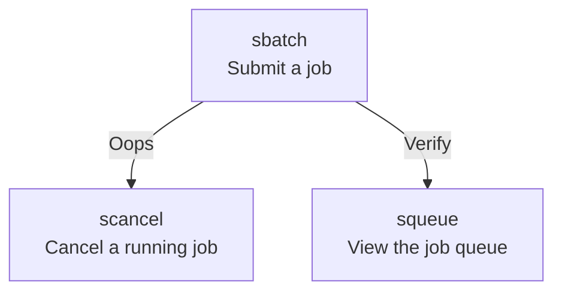

# Submitting jobs

!!!- info "Learning objectives"

    - Practice using the UPPMAX documentation
    - Can submit a job from the command line
    - Can submit a job using a script

???- question "For teachers"

    Prerequisites are:

    - [...]

    Preparations are:

    - [...]

    Teaching goals are:

    - [...]


    Lesson plan:

    ```mermaid
    gantt
      title Something
      dateFormat X
      axisFormat %s
      section First hour
      Course introduction: done, course_intro, 0, 10s
      Prior : intro, after course_intro, 5s
      Present: theory_1, after intro, 5s
      Challenge: crit, exercise_1, after theory_1, 40s
      Break: crit, milestone, after exercise_1
      section Second hour
      Challenge: crit, exercise_2, 0, 10s
      Feedback: feedback_2, after exercise_2, 10s
      SLURM: done, slurm, after feedback_2, 25s
      Break: done, milestone, after slurm
    ```

    Prior questions:

    - [...]


???- question "For teachers"

    Prerequisites are:

    - [...]

    Preparations are:

    - [...]

    Teaching goals are:

    - [...]


    Lesson plan:

    ```mermaid
    gantt
      title Something
      dateFormat X
      axisFormat %s
      section First hour
      Course introduction: done, course_intro, 0, 10s
      Prior : intro, after course_intro, 5s
      Present: theory_1, after intro, 5s
      Challenge: crit, exercise_1, after theory_1, 40s
      Break: crit, milestone, after exercise_1
      section Second hour
      Challenge: crit, exercise_2, 0, 10s
      Feedback: feedback_2, after exercise_2, 10s
      SLURM: done, slurm, after feedback_2, 25s
      Break: done, milestone, after slurm
    ```

    Prior questions:

    - [...]


## Why?

You want to do calculations that take a long time and use much CPU
power. To do so, one needs to schedule these jobs!

This is a short introduction in how to reach the calculation nodes
Wednesday afternoon is wedded to this topic!

## The job scheduler

The job scheduler has multiple programs,
we use a minimal set of these three:



## Exercises

### Exercise 1: see the job queue

Go to the UPPMAX documentation at [https://docs.uppmax.uu.se](https://docs.uppmax.uu.se),
then answer these questions:

- Find the page on `squeue`, the program to view the job queue

???- question "Answer"

    It can be found at <https://docs.uppmax.uu.se/software/squeue/>

- View all jobs in the queue

???- question "Answer"

    View all jobs in the queue:

    ```bash
    squeue
    ```

- View all your jobs in the queue

???- question "Answer"

    View your jobs in the queue:

    ```bash
    squeue -u $USER
    ```

    You will probably see that you have zero jobs scheduled

### Exercise 2: submit a job

### Exercise 3: cancel a job


## Old

## Slurm, sbatch, the job queue

- Problem: 1000 users, 500 nodes, 10k cores
- Need a queue:


- x-axis: cores, one thread per core
- y-axis: time
<br/><br/>
- [Slurm](https://slurm.schedmd.com/) is a jobs scheduler
- Plan your job and but in the slurm job batch (sbatch)
    `sbatch <flags> <program>` or
    `sbatch <job script>`

- Easiest to schedule *single-threaded*, short jobs


- Left: 4 one-core jobs can run immediately (or a 4-core wide job).

    - The jobs are too long to fit in core number 9-13.

- Right: A 5-core job has to wait.

    - Too long to fit in cores 9-13 and too wide to fit in the last cores.

## Jobs

- Job = what happens during booked time
- Described in a Bash script file
    - Slurm parameters (**flags**)
    - Load software modules
    - (Move around file system)
    - Run programs
    - (Collect output)
- ... and more

## Slurm parameters

- 1 mandatory setting for jobs:
    - Which compute project? (`-A`)
    - For example, if your project is named ``NAISS 2017/1-334`` you specify ``-A naiss2017-1-234``

- 3 settings you really should set:
    - Type of queue? (`-p`)
        - core, node, (for short development jobs and tests: devcore, devel)
    - How many cores? (`-n`)
        - up to 16 (20 on Rackham) for core job
    - How long at most? (`-t`)
- If in doubt:
    - -`p core`
    - -`n 1`
    - `-t 7-00:00:00`


- Where should it run? (`-p node` or `-p core`)
- Use a whole node or just part of it?
    - 1 node = 20 cores (16 on Bianca & Snowy)
    - 1 hour walltime = 20 core hours = expensive
    - Waste of resources unless you have a parallel program or need all the memory, e.g. 128 GB per node
- Default value: core

### Walltime at the different clusters

- Rackham: 10 days
- Snowy: 30 days
- Bianca: 10 days


### A simple job script template

```bash=
#!/bin/bash -l 
# tell it is bash language and -l is for starting a session with a "clean environment, e.g. with no modules loaded and paths reset"

#SBATCH -A naiss2023-22-793  # Project name

#SBATCH -p devcore  # Asking for cores (for test jobs and as opposed to multiple nodes) 

#SBATCH -n 1  # Number of cores

#SBATCH -t 00:10:00  # Ten minutes

#SBATCH -J Template_script  # Name of the job

# go to some directory

cd /proj/introtouppmax/labs
pwd -P

# load software modules

module load bioinfo-tools
module list

# do something

echo Hello world!  

```

## Other Slurm tools

- ``squeue`` — quick info about jobs in queue
- ``jobinfo`` — detailed info about jobs
- ``finishedjobinfo`` — summary of finished jobs
- ``jobstats``— efficiency of booked resources

``````{challenge} Exercise at home
- Copy the code just further up!
- Put it into a file named “jobtemplate.sh”
- Make the file executable (chmod)
- Submit the job:
```  {code-block} console

$ sbatch jobtemplate.sh
```
- Note the job id!
- Check the queue:

```  {code-block} console
$ squeue -u <username>
$ jobinfo -u <username>
```
- When it’s done (rather fast), look for the output file (slurm-<jobid>.out):

```  {code-block} console
$ ls -lrt slurm-*
```
- Check the output file to see if it ran correctly

```  {code-block} console
$ cat <filename>
```
``````

## What kind of work are you doing?

- Compute bound
    - you use mainly CPU power (more cores can help)
- Memory bound
    - if the bottlenecks are allocating memory, copying/duplicating

**More on Wednesday afternoon!**

```{keypoints}
- You are always in the login node unless you:
  - start an interactive session
  - start a batch job
- Slurm is a job scheduler
  - add flags to describe your job.

