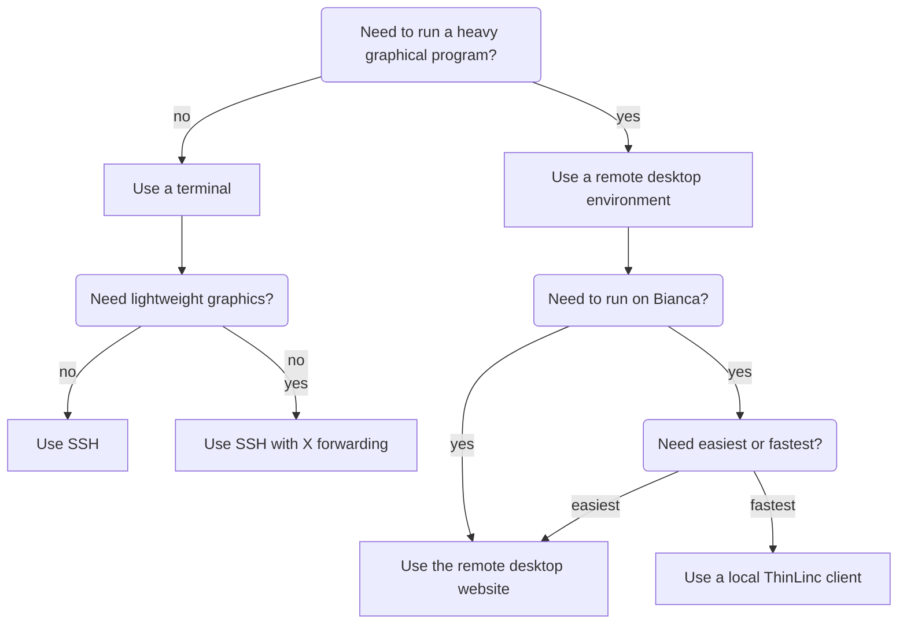

# Login

!!!- info "Learning objectives"

    - Practice using the UPPMAX documentation
    - Understand that there are two environments
    - Understand that after login, one is on a login node
    - Understand what a login node is
    - Understand that on a login node, one only runs light commands

???- question "For teachers"

    Teaching goals are:

    - Learners have practiced using the UPPMAX documentation
    - Learners have read and heard that there are two environments
    - Learners have read and heard that after login, one is on a login node
    - Learners have read and heard about what a login node is in general terms
    - Learners have practiced understanding what one runs on a login node

    Lesson plan:

    ```mermaid
    gantt
      title Something
      dateFormat X
      axisFormat %s
      section First hour
      Course introduction: done, course_intro, 0, 10s
      Prior : intro, after course_intro, 5s
      Present: theory_1, after intro, 5s
      Challenge: crit, exercise_1, after theory_1, 40s
      Break: crit, milestone, after exercise_1
      section Second hour
      Challenge: crit, exercise_2, 0, 10s
      Feedback: feedback_2, after exercise_2, 10s
      SLURM: done, slurm, after feedback_2, 25s
      Break: done, milestone, after slurm
    ```

    Prior questions:

    - What is 'HPC' in 'HPC cluster'?
    - What is 'cluster' in 'HPC cluster'?
    - Where are the UPPMAX HPC clusters?
    - When does one use an HPC cluster?
    - How does using an HPC clusters look like?
    - How does one tell the UPPMAX HPC clusters what to do?

## Why?

To use any UPPMAX cluster, one needs to log in.
In this session, we learn there are multiple ways to login.
After loggin in, one wants to behave considerate towards other users.

## Login

There are multiple ways to login:

Login                |Description
---------------------|----------------------------------------------
Website              |Remote desktop, no installation needed, slow
Terminal             |Console environment, recommended
Local ThinLinc client|Remote desktop, recommended, need installation



## Prerequisites

It is assumed you have fulfilled all
[prerequisites for using Rackham](https://docs.uppmax.uu.se/getting_started/rackham_usage_prerequisites/).

## Exercises

We will practice using the UPPMAX documentation,
so that you are confident that you can find what you need
and understand what is written.
Also, it helps UPPMAX staff find out how good our documentation is :-)

### Exercise 1: general understanding

Go to the UPPMAX documentation at [https://docs.uppmax.uu.se](https://docs.uppmax.uu.se),
then answer these questions:

- Where is it is described how to log in to Rackham?

???- question "Answer"

    It is at <https://docs.uppmax.uu.se/getting_started/login_rackham/>.

    You can reach this page by searching for 'Login Rackham' or 'Log in Rackham'. 

- How many environments can one log in to?

???- question "Answer"

    Two.

    At <https://docs.uppmax.uu.se/getting_started/login_rackham/>
    there are multiple ways described how to login.

    There are two different environments one can log in to:

    - a remote desktop environment
    - a console environment
 
- The documentation of how to log in to Rackham states: 'After loggin in, one is on a login node'.
  Where it is described what a login node?

???- question "Answer"

    It is at <https://docs.uppmax.uu.se/cluster_guides/login_node/>.

    You can reach this page by searching for 'Login node' or click on the link
    in the documentation

- What is a login node?

???- question "Answer"

    From <https://docs.uppmax.uu.se/cluster_guides/login_node/>:

    > A login node is the computer where you arrive
    > after logging in to an UPPMAX HPC cluster

- Should the examples below be done on the Rackham login node? 
  What is your reasoning?

    - Create a directory
    - Copy a dataset of 100 gigabytes to another folder
    - Download a dataset of 100 gigabytes
    - Edit a file using an IDE such as RStudio, VSCode or VSCodium
    - Edit a file using a simple text editor such as `emacs`, `nano` or `vim`
    - Run a bash/Nextflow/Python/R script

???- question "Answers"

    > - Create a directory

    Can be done on the Rackham login node, as this is a very light calculation
    that takes a very short time to run.

    > - Copy a dataset of 100 gigabytes to another folder

    Can be done on the Rackham login node, as this is a light calculation
    that takes a reasonable short time to run.

    > - Download a dataset of 100 gigabytes

    Can be done on the Rackham login node, as this is a light calculation
    that takes a reasonable short time to run.

    > - Edit a file using an IDE such as RStudio, VSCode or VSCodium

    Don't do this on a Rackham login node. These program
    need a lot of CPU and memory and are typically used for a long time.

    Instead, use [an interactive session](start_interactive_session.md).

    > - Edit a file using a simple text editor such as `emacs`, `nano` or `vim`

    Can be done on the Rackham login node, as this is such a light calculation
    that it can be run for a long time.

    > - Run a bash/Nextflow/Python/R script

    This depends on what the script does:
    if it does a light calculation or takes a reasonable short time to run,
    you can run it on a login node.

    Else, you will have to use [the Slurm job scheduler](slurm.md).

Done?

- If you want to know what an HPC cluster is in more detail, 
  read up on [the UPPMAX clusters](https://docs.uppmax.uu.se/cluster_guides/uppmax_cluster/)
- Else move on to the next session
