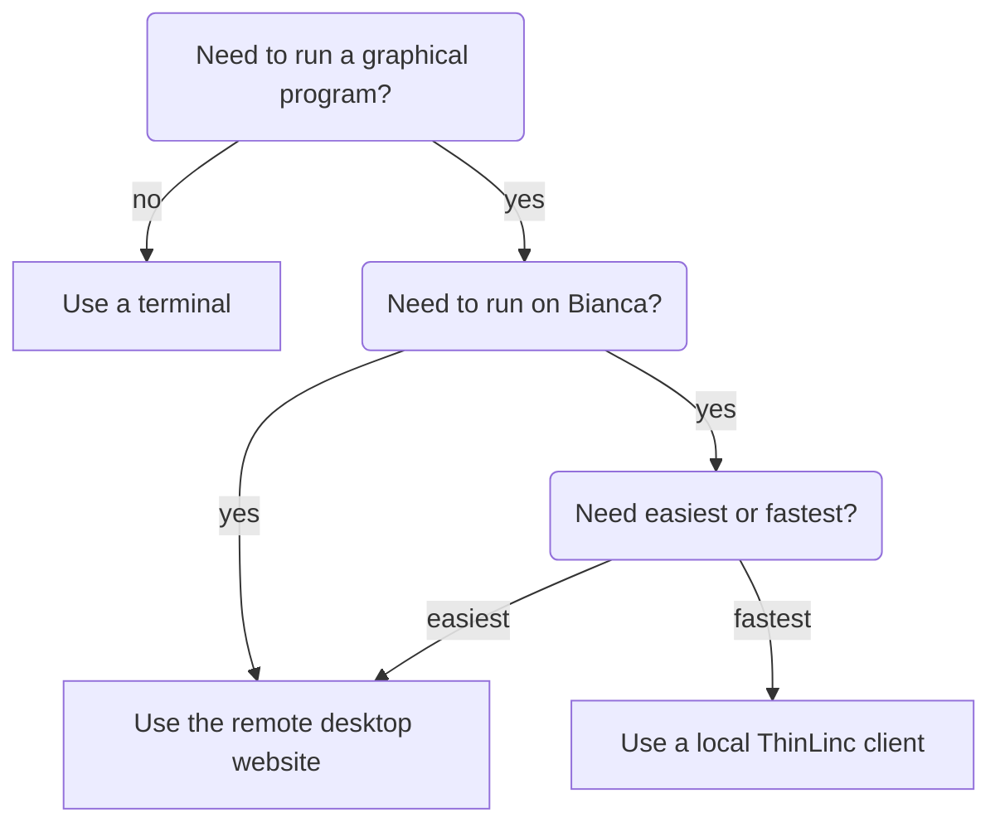

# Login

!!!- info "Learning objectives"

    - Understand that there are two environments
    - Understand that after login, one is on a login node
    - Understand what a login node is
    - Understand that on a login node, one only runs light commands
    - Can log in to the Rackham remote desktop environment using the website
    - [MOVE TO OTHER SESSION] Can copy-paste text between local computer and the Rackham remote desktop website
    - If needed: has installed an SSH client
        - Windows: MobaXTerm
    - Can log in to the console environment using a terminal with X forwarding
    - [MOVE TO OTHER SESSION] Understands what the prompt is
    - [MOVE TO OTHER SESSION] Can use tab-completion with the prompt
    - (optional) Can log in to the console environment using a terminal with X forwarding
    - (optional) Can log in to the Rackham remote desktop environment using a local ThinLinc client

???- question "For teachers"

    Prerequisites are:

    - [...]

    Preparations are:

    - [...]

    Teaching goals are:

    - [...]


    Lesson plan:

    ```mermaid
    gantt
      title Something
      dateFormat X
      axisFormat %s
      section First hour
      Course introduction: done, course_intro, 0, 10s
      Prior : intro, after course_intro, 5s
      Present: theory_1, after intro, 5s
      Challenge: crit, exercise_1, after theory_1, 40s
      Break: crit, milestone, after exercise_1
      section Second hour
      Challenge: crit, exercise_2, 0, 10s
      Feedback: feedback_2, after exercise_2, 10s
      SLURM: done, slurm, after feedback_2, 25s
      Break: done, milestone, after slurm
    ```

    Prior questions:

    - [...]


## Why?

- How to reach UPPMAX clusters?
- Where do I arrive when I log in? Login or calculation node?
- What clients should/could I use for my work at UPPMAX?
- How can I enable graphics?

## Login

There are multiple ways to login:

Login                |Description
---------------------|----------------------------------------------
Website              |Remote desktop, no installation needed, slow
Terminal             |Console environment, recommended
Local ThinLinc client|Remote desktop, recommended, need installation



## Prerequisites

If you lack a user account, 
visit the [Getting started page](https://www.uppmax.uu.se/support/getting-started/course-projects/)

## Exercises

[...]

### Working form

[...]

### Exercise 1: general understanding

Theory questions here.

### Exercise 2: login via website

- Read [Log in to Rackham's remote desktop via a webbrowser](http://docs.uppmax.uu.se/getting_started/login_rackham_remote_desktop_website/)

### Exercise 3: use website

- Read [ThinLinc](http://docs.uppmax.uu.se/software/thinlinc/)
- Copy-paste big text from local computer to your remote desktop
- Copy-paste big text from your remote desktop to your local computer
- File navigation: Where are we? Which folder? 
- File management: create file, delete file, create folder, delete folder
- Start a terminal
- Run `xeyes`

### Exercise 4: login via SSH with X-forwarding

- Read [SSH clients](http://docs.uppmax.uu.se/software/ssh_client/)
- Read [Login Rackham with X-forwarding](http://docs.uppmax.uu.se/getting_started/login_rackham/#terminal-with-x11-server-and-light-graphics)
- Run `xeyes`

### (optional Exercise 5: login via SSH without X-forwarding

- Login without X forwarding
- Observe graphics do not work, by running `xeyes`

### (optional) Exercise 6: login via local ThinLinc client

- Read [Log in to Rackham's remote desktop environment using a local ThinLinc client](http://docs.uppmax.uu.se/getting_started/login_rackham_remote_desktop_local_thinlinc_client/)


## Unprocessed material

```
## The login


   - **interact with you local computer**
     - Mac/Linux: you can always work in a local shell (mutiple terminal windows open)
        - (S)FTP browser: *Filezilla*, *Cyberduck*
     - Windows
        - (S)FTP browser: *WinSCP*
        - *MobaXterm* has built-in SFTP browser
        - you may benefit from having a *Windows Subsystem for Linux, WSL(2)*
                
```

## General understanding

- When logging in to UPPMAX from your local computer you will arrive to your home folder at the login node.
- This means that only light analysis and and calculations should be made here.
- You will see this in the prompt after "@" as the clustername and a low number. For instance:
   ```console
      [<user>@rackham3 linux_tutorial]$
    ```
- You will later learn how to reach the calculation nodes. Then the prompt states the node number with a single letter, like "r" for Rackham. For instance:
   ```console
      [<user>@r484 linux_tutorial]
   ```

## Terminals 

`````{tabs} 
````{tab} Mac

- Start terminal (e.g. from Launchpad) or [iTerm2](https://iterm2.com/)
```{code-block} console
$ ssh <username>@rackham.uppmax.uu.se
```
- "< >" prompts you to set the keyword specific for you or your needs. In the example above, this is basically your username.


- iTerm2 goodies:
  - You can save hosts for later.
  - Drag and drop scp

````

````{tab} Windows

- Start terminal (see below)
```console
$ ssh <username>@rackham.uppmax.uu.se
```
- "< >" prompts you to set the keyword specific for you or your needs. In the example above, this is basically your username.


- the ssh (secure shell) client [**putty**](https://www.putty.org/) is sufficient first days of the course!

    - You can save hosts for later.
    - No graphics.
    
- Windows Powershell terminal can also work

    - Cannot save hosts
    - no graphics
    - [PowerShell](https://learn.microsoft.com/en-us/powershell/)
    
- Windows command prompt can also work

    - Cannot save hosts
    - no graphics
    - [Command Prompt](https://www.makeuseof.com/tag/a-beginners-guide-to-the-windows-command-line/)

- [Git bash](https://gitforwindows.org/)

````
`````

## Terminal with X11 server and light graphics

`````{tabs} 
````{tab} Mac

- Download XQuartz or other X11 server for Mac OS
  - [https://www.xquartz.org/](https://www.xquartz.org/)

- Start terminal (e.g. from Launchpad) or [iTerm2](https://iterm2.com/)

- ``-X``      Enables X11 forwarding. 

````

````{tab} Windows

- Download and install ONE of the X-servers below (to enable graphics)
  - [GWSL](https://opticos.github.io/gwsl) (recommended because of hardware integration)
  - [X-ming](https://sourceforge.net/projects/xming/)
  - [VCXSRV](https://sourceforge.net/projects/vcxsrv/) 


- or... 
- Install a ssh (secure shell) program with built-in X11 and sftp file manager
  - [**MobaXterm**](https://mobaxterm.mobatek.net/)
    - sftp frame makes it easy to move, upload and download files.
    - ... though downloading from remote host to local is usually easier.
    - tabs for several sessions


- Start local terminal and a SSH session by:

```console
$ ssh -Y <username>@rackham.uppmax.uu.se
```


- Or even better, create and save a SSH session, as shown in image below.
  - This allows you to use MobaXterm as a file manager and  to use the built-in graphical texteditor.
  - You can rename the session in the Bookmark settings tab.


````
`````

```{admonition} X11-forwarding from the command line (generally)

- Graphics can be sent through the SSH connection you’re using to connect
  - Use primarily `ssh -Y <...>` or secondary `ssh -X <...>`

- The X servers that enables graphics are needed, as mentioned above!
  - When starting a graphical program, a new window will open, but your terminal will be “locked”.
  - Run using "`&`" at the end to run it as a background process e.g. "`xeyes &`" or “`gedit &`”


- Alternatively, use `<ctrl>-z` to put e.g. gedit to sleep and type "`bg`" to make last process in background.
```


``````{challenge} Login to **Rackham**, using your terminal
- First try:
```console
$ ssh -Y <username>@rackham.uppmax.uu.se
```
- If you receive errors or warnings, instead try:
```console
$ ssh <username>@rackham.uppmax.uu.se
```
- If you do have X11 installed:
```console
$ xeyes &
```
``````

## Graphical file manager

- This is good if you want to move many files between host and local and cannot use wildcards.

`````{tabs} 
````{tab} Mac

- For copying of files with sftp (secure file transfer protocol) between your client computer (where you are) and the cluster **Filezilla** can be the choice.
- [Filezilla](https://filezilla-project.org/download.php?type=client)
 


- [Cyberduck](https://cyberduck.io/)

````

````{tab} Windows

- For copying of files between your client computer (where you are) and the cluster **WinSCP** can also be the choice.
  - [https://winscp.net/eng/download.php](https://winscp.net/eng/download.php) 

- 

- [Cyberduck](https://cyberduck.io/)

- [Filezilla](https://filezilla-project.org/download.php?type=client)

```` 
`````

```{callout} Problems with installations?
Putty/Terminal  without X11 is sufficient first days of the course!
```


## Linux on your computer

```{admonition} Local Linux environment
   - You may sometimes benefit from having a local Linux environment.
   - Examples:
     - Mimic cluster environment to work with your local files and data as on the Cluster
     - get used to Linux (!)
   - Mac is UNIX and very Linux-like
   - Windows requires WSL (Windows subsystem for Linux)
```

```{solution} For windows users who wants to get started with WSL (not covered here)
- Install WSL (Windows Subsystem for Linux) 
    - https://docs.microsoft.com/en-us/windows/wsl/install-win10 (Links to an external site.)
    - Don’t forget to update to wsl2
- Install a distribution or a ssh (secure shell) program
  - Distribution such as ubuntu or
  - (recommended) a ssh program such as MobaXTerm
  - https://mobaxterm.mobatek.net/ (Links to an external site.)
    - sftp frame makes it easy to move, upload and download files.
- You may want to check this webpage as well!
  - https://hackmd.io/@pmitev/Linux4WinUsers (Links to an external site.)
```
 
## ThinLinc (all platforms!)

- Both Rackham and Bianca offer graphical login.
- This gives you a desktop environment, as if you were working on your own computer!
- On web:
  - [https://rackham-gui.uppmax.uu.se](https://rackham-gui.uppmax.uu.se)
  - [https://bianca.uppmax.uu.se](https://bianca.uppmax.uu.se)
    - requires [2-factor authentication](https://www.uppmax.uu.se/support/user-guides/setting-up-two-factor-authentication/)


 - Or use the client (only for Rackham)
   - [https://www.cendio.com/thinlinc/download](https://www.cendio.com/thinlinc/download)

```{challenge} Try Thinlinc from web
  - Try the web version now if you don't already have the software installed!
```

 ```{keypoints}
- When you log in from your local computer you will always arrive at a login node with limited resources. 
  - You reach the calculations nodes from within the login node (See  Submitting jobs section)
- You reach UPPMAX clusters either using a terminal client or Thinlinc
- Graphics are included in Thinlinc and from terminal if you have enabled X11.
- Which client to use?
  - Graphics and easy to use
    - ThinLinc
  - Best integrated systems
    - Visual Studio Code has several extensions (remote, SCP, programming IDE:s)
    - Windows: MobaXterm is somewhat easier to use.
  
