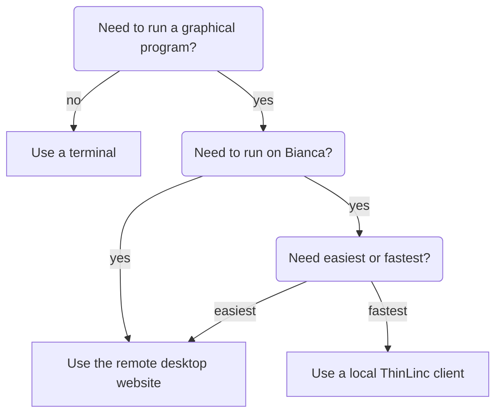

# Login

!!!- info "Learning objectives"

    - Understand that there are two environments
    - Understand that after login, one is on a login node
    - Understand what a login node is
    - Understand that on a login node, one only runs light commands

???- question "For teachers"

    Prerequisites are:

    - [...]

    Preparations are:

    - [...]

    Teaching goals are:

    - [...]


    Lesson plan:

    ```mermaid
    gantt
      title Something
      dateFormat X
      axisFormat %s
      section First hour
      Course introduction: done, course_intro, 0, 10s
      Prior : intro, after course_intro, 5s
      Present: theory_1, after intro, 5s
      Challenge: crit, exercise_1, after theory_1, 40s
      Break: crit, milestone, after exercise_1
      section Second hour
      Challenge: crit, exercise_2, 0, 10s
      Feedback: feedback_2, after exercise_2, 10s
      SLURM: done, slurm, after feedback_2, 25s
      Break: done, milestone, after slurm
    ```

    Prior questions:

    - [...]


## Why?

- How to reach UPPMAX clusters?
- Where do I arrive when I log in? Login or calculation node?
- What clients should/could I use for my work at UPPMAX?
- How can I enable graphics?

## Login

There are multiple ways to login:

Login                |Description
---------------------|----------------------------------------------
Website              |Remote desktop, no installation needed, slow
Terminal             |Console environment, recommended
Local ThinLinc client|Remote desktop, recommended, need installation



## Prerequisites

If you lack a user account, 
visit the [Getting started page](https://www.uppmax.uu.se/support/getting-started/course-projects/)

## Exercises

[...]

### Working form

[...]

### Exercise 1: general understanding

Theory questions here.
