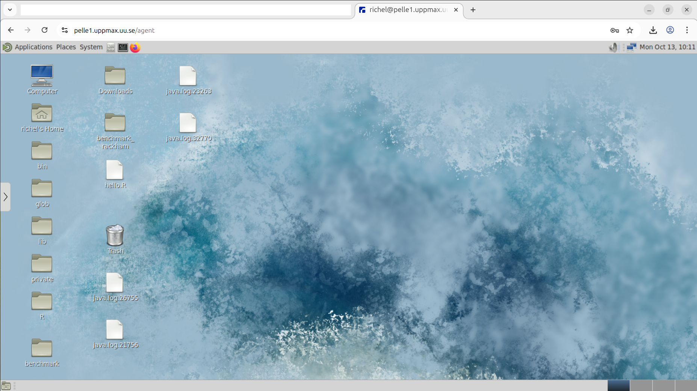

---
tags:
    - lesson
    - login
    - log in
    - log in to
    - log into
    - remote desktop
    - remote desktop environment
---

# Log in to a remote desktop environment

!!!- info "Learning outcomes"

    - Practice using the UPPMAX documentation
    - Can log in to the Pelle remote desktop environment using the website
    - (optional) Can log in to the Pelle remote desktop environment
      using a local ThinLinc client

???- question "For teachers"

    Teaching goals are:

    - Learners have practiced using the UPPMAX documentation
    - Learners haved logged in to the Pelle remote desktop environment
      using the website
    - (optional) Learners have logged in to the Pelle remote desktop
      environment
      using a local ThinLinc client


    Lesson plan:

    ```mermaid
    gantt
      title Login to remote desktop via website
      dateFormat X
      axisFormat %s
      section First hour
      Prior : prior, 0, 5s
      Present: present, after prior, 2s
      %% It took me 5 mins, here I do that time x2
      Challenge: crit, challenge, after present, 10s
      %% Here I use the same time it took me to give feedback
      Feedback: feedback, after challenge, 5s
    ```

    Prior questions:

    - What is a desktop environment?
    - How does a desktop environment look like?
    - What is a remote desktop environment?
    - How does a remote desktop environment look like?
    - Who has already logged in to a remote desktop environment?
    - Why would one use a remote desktop environment?
    - What are disadvantages of a remote desktop environment?

    Feedback questions:

    - When would you recommend a colleague to use a remote desktop environment?



> The Pelle remote desktop environment.

## Why?

You want to use an HPC cluster with a visual and familiar user interface.

The UPPMAX clusters provide for a remote desktop environment.
It is a remote environment, as we need to log in to a cluster remotely,
i.e. we do not plug in our keyboard and monitor to a node.

There are two ways to access the remote remote desktop environment of Pelle:

- use a website
- use a program

In this session, we will at least access the Pelle remote desktop environment
using a website, as this is easier to do.

## Exercises

???- question "Need a video?"

    Watch the YouTube video
    [Intro to UPPMAX Day 1: Log in to a remote desktop environment](https://youtu.be/vHlHf7OP8s8).

    Pelle works the same a Rackham in these contexts.

There are two exercises, of which the second is optional.

## Exercise 1: login via website

Go to the UPPMAX documentation at
[https://docs.uppmax.uu.se](https://docs.uppmax.uu.se),
then answer these questions:

- Find the page where it is documented to log in to Pelle's remote desktop
  via a webbrowser.

???- question "Answer"

    [The 'Log in to Pelle's remote desktop via a webbrowser' UPPMAX page](https://docs.uppmax.uu.se/getting_started/login_pelle_remote_desktop_website/).

- Follow the procedure

### (optional) Exercise 2: login via a program

Go to the UPPMAX documentation at
[https://docs.uppmax.uu.se](https://docs.uppmax.uu.se),
then answer these questions:

- Find the page where it is documented to log in to Pelle's remote desktop using
  a program. What is that program called?

???- question "Answer"

    <!-- markdownlint-disable MD013 --><!-- Indeed, line lengths beyond 80 characters -->

    It is hard to search for which program that is. However,
    using the
    ['log in to Pelle' page](https://docs.uppmax.uu.se/getting_started/login_pelle/)
    shows the login via 'a local ThinLinc client'.

    That is the program's name: ThinLinc

    How to log in to Pelle's remote desktop environment using a local ThinLinc
    client is documented
    [at the 'Log in to Pelle's remote desktop environment using a local ThinLinc client' UPPMAX page](https://docs.uppmax.uu.se/getting_started/login_pelle_remote_desktop_local_thinlinc_client/)

    <!-- markdownlint-enable MD013 -->

- Follow the procedure

???- question "For teachers"

    Do not forget the Menti! 1 question
