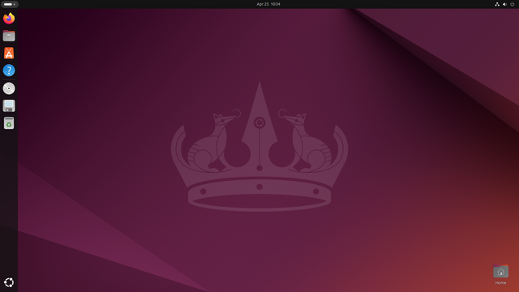

# Login

!!!- info "Learning objectives"

    - Can log in to the Rackham remote desktop environment using the website
    - (optional) Can log in to the Rackham remote desktop environment using a local ThinLinc client

???- question "For teachers"

    Prerequisites are:

    - [...]

    Preparations are:

    - [...]

    Teaching goals are:

    - [...]


    Lesson plan:

    ```mermaid
    gantt
      title Something
      dateFormat X
      axisFormat %s
      section First hour
      Course introduction: done, course_intro, 0, 10s
      Prior : intro, after course_intro, 5s
      Present: theory_1, after intro, 5s
      Challenge: crit, exercise_1, after theory_1, 40s
      Break: crit, milestone, after exercise_1
      section Second hour
      Challenge: crit, exercise_2, 0, 10s
      Feedback: feedback_2, after exercise_2, 10s
      SLURM: done, slurm, after feedback_2, 25s
      Break: done, milestone, after slurm
    ```

    Prior questions:

    - [...]


## Why?

You want to use an HPC cluster with a visual and familiar user interface.

## A remote desktop environment

Most people use a desktop environment:

Operating system|Example desktop environment
----------------|--------------------------
Linux           |
MacOS/OS X      |
MS-DOS          |

The UPPMAX clusters provide for a remote desktop environment.
It is a remote environment, as we need to log in to a cluster remotely,
i.e. we do not plug in our keyboard and monitor to a node.

There are two ways to access the remote remote desktop environment of Rackham:

- use a website
- use a program

In this session, we will access the Rackham remote desktop environment.

## Exercises

[...]

### Working form

[...]

### Exercise 1: general understanding

[Theory questions here]

### Exercise 2: login via website

- Read [Log in to Rackham's remote desktop via a webbrowser](http://docs.uppmax.uu.se/getting_started/login_rackham_remote_desktop_website/).
- Log in to Rackham's remote desktop via a webbrowser

### (optional) Exercise 3: login via local ThinLinc client

- Read [Log in to Rackham's remote desktop environment using a local ThinLinc client](http://docs.uppmax.uu.se/getting_started/login_rackham_remote_desktop_local_thinlinc_client/)
