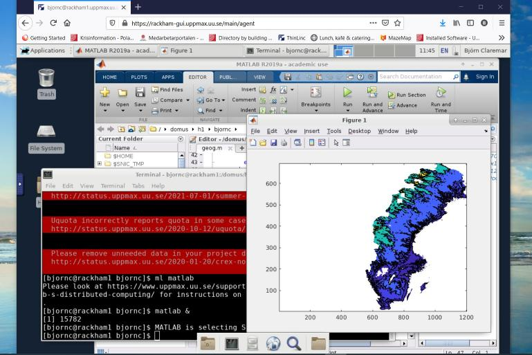

# Log in to a remote desktop environment

!!!- info "Learning objectives"

    - Practice using the UPPMAX documentation
    - Can log in to the Rackham remote desktop environment using the website
    - (optional) Can log in to the Rackham remote desktop environment using a local ThinLinc client

???- question "For teachers"

    Prerequisites are:

    - [...]

    Preparations are:

    - [...]

    Teaching goals are:

    - [...]


    Lesson plan:

    ```mermaid
    gantt
      title Something
      dateFormat X
      axisFormat %s
      section First hour
      Course introduction: done, course_intro, 0, 10s
      Prior : intro, after course_intro, 5s
      Present: theory_1, after intro, 5s
      Challenge: crit, exercise_1, after theory_1, 40s
      Break: crit, milestone, after exercise_1
      section Second hour
      Challenge: crit, exercise_2, 0, 10s
      Feedback: feedback_2, after exercise_2, 10s
      SLURM: done, slurm, after feedback_2, 25s
      Break: done, milestone, after slurm
    ```

    Prior questions:

    - What is a desktop environment?
    - How does a desktop environment look like?
    - What is a remote desktop environment?
    - How does a remote desktop environment look like?
    - Who has already logged in to a remote desktop environment?
    - Why would one use a remote desktop environment?
    - What are disadvantages of a remote desktop environment?



> The Rackham remote desktop environment.

## Why?


You want to use an HPC cluster with a visual and familiar user interface.

The UPPMAX clusters provide for a remote desktop environment.
It is a remote environment, as we need to log in to a cluster remotely,
i.e. we do not plug in our keyboard and monitor to a node.

There are two ways to access the remote remote desktop environment of Rackham:

- use a website
- use a program

In this session, we will at least access the Rackham remote desktop environment
using a website, as this is easier to do.

## Exercises

There are two exercises, of which the second is optional.

### Exercise 1: login via website

Go to the UPPMAX documentation at [https://docs.uppmax.uu.se](https://docs.uppmax.uu.se),
then answer these questions:

- Find the page where it is documented to log in to Rackham's remote desktop via a webbrowser.

???- question "Answer"

    The page is [here](http://docs.uppmax.uu.se/getting_started/login_rackham_remote_desktop_website/).

- Follow the procedure

### (optional) Exercise 2: login via a program

Go to the UPPMAX documentation at [https://docs.uppmax.uu.se](https://docs.uppmax.uu.se),
then answer these questions:

- Find the page where it is documented to log in to Rackham's remote desktop using
  a program. What is that program called?

???- question "Answer"

    It is hard to search for which program that is. However,
    using the ['log in to Rackham' page](https://docs.uppmax.uu.se/getting_started/login_rackham/)
    shows the login via 'a local ThinLinc client'.

    That is the program's name: ThinLinc

    How to log in to Rackham's remote desktop environment using a local ThinLinc 
    client is documented [here](http://docs.uppmax.uu.se/getting_started/login_rackham_remote_desktop_local_thinlinc_client/)

- Follow the procedure
