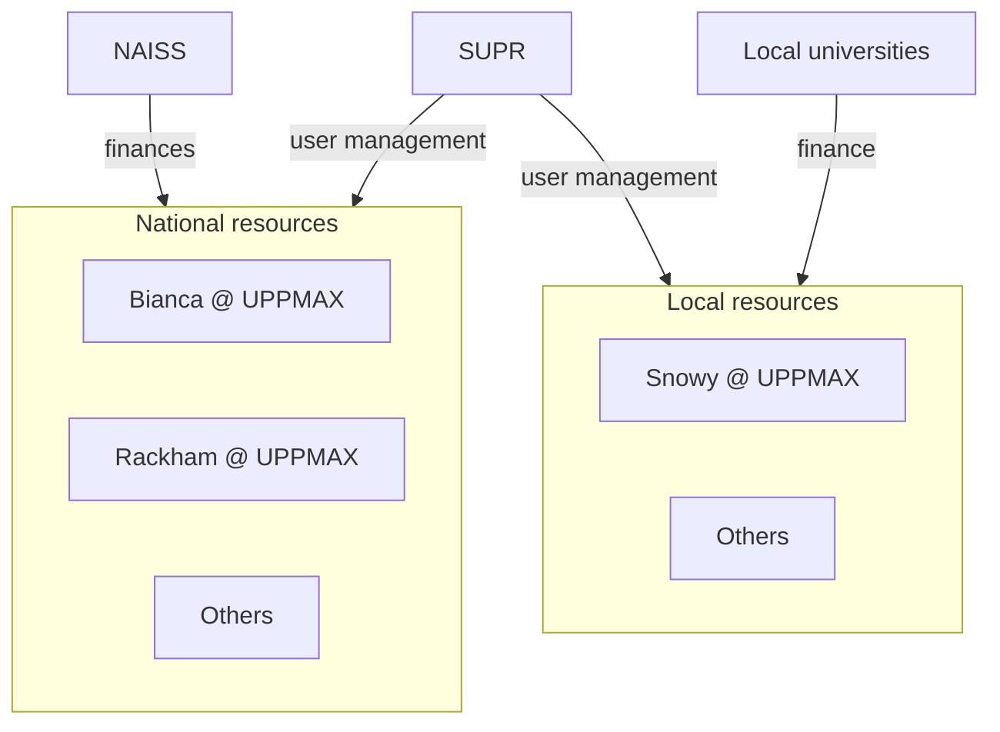

---
tags:
  - lesson
  - NAISS
  - national
---

# NAISS

!!!- info "Learning objectives"

    - Be able to find which resources exist
    - Be able to apply for a resource

## Why?

UPPMAX is part of NAISS.

Goal of this session is to find out which resources exists in Sweden
and how to apply for these.

## Overview

## About NAISS

From [the 'About us' page of the NAISS website](https://www.naiss.se/about-us/):

> The National Academic Infrastructure for Supercomputing in Sweden (NAISS)
> is an infrastructure organisation for high-performance computing,
> storage, and data services for academic users in Sweden

NAISS resources are free (as in beer) to researchers all over Sweden
and can be found at
[the 'Resources' page of the NAISS website](https://www.naiss.se/resources/).

## SUPR

SUPR allows a user to apply for resources,
both NAISS and local (e.g. Uppsala) resources.

Resource application is done in rounds.
All SUPR rounds can be found at
[https://supr.naiss.se/round/](https://supr.naiss.se/round/).

Typically, SUPR rounds come in three project sizes. The bigger the
project, the less often one can apply and the higher job title one needs.

## Exercises

### Exercise 1: NAISS resources

Read
[the 'Resources' page of the NAISS website](https://www.naiss.se/resources/)
then answer these questions:

- Which resource is most suitable to store and work on sensitive data?
- Which resource is most suitable to work with AI tools?
- Which resource is most suitable to host a website and/or service?
- Which resource is most suitable to store data publicly?

### Exercise 2: Apply for resources

At [the 'Resources' page of the NAISS website](https://www.naiss.se/resources/),
request resources for Rackham. This will take you to
the [SUPR NAISS page on Rackham](https://supr.naiss.se/resource/rackham/).

Apply for a 'Small Compute' project.

- What academic level (BSc, MSc, PhD student, etc.)
  do you need to have to be eligible?
- How many CPU core hours per month would you get for Rackham?

Cancel this application.

Apply for a 'Medium Compute' project.

- What academic level (BSc, MSc, PhD student, etc.)
  do you need to have to be eligible?
- How many CPU core hours per month would you get for Rackham?

Cancel this application.
