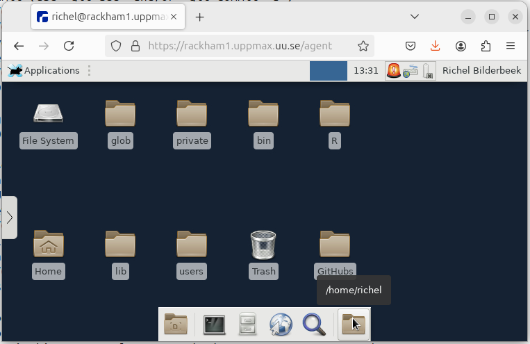

# Use the remote desktop environment

!!!- info "Learning objectives"

    - Can copy-paste text between local computer and the Rackham remote desktop website
    - Can navigate the file system
    - Can do file management
    - Can start a terminal
    - Can start a text editor

???- question "For teachers"

    Prerequisites are:

    - [...]

    Preparations are:

    - [...]

    Teaching goals are:

    - [...]


    Lesson plan:

    ```mermaid
    gantt
      title Something
      dateFormat X
      axisFormat %s
      section First hour
      Course introduction: done, course_intro, 0, 10s
      Prior : intro, after course_intro, 5s
      Present: theory_1, after intro, 5s
      Challenge: crit, exercise_1, after theory_1, 40s
      Break: crit, milestone, after exercise_1
      section Second hour
      Challenge: crit, exercise_2, 0, 10s
      Feedback: feedback_2, after exercise_2, 10s
      SLURM: done, slurm, after feedback_2, 25s
      Break: done, milestone, after slurm
    ```

    Prior questions:

    - [...]


## Why?

After [logging in to the remote desktop](login_remote_desktop.md),
we can work with Rackham. Let's make sure we can do so :-)

## Exercises

Log in to the remote desktop environment of Rackham.

### Exercise 1: file navigation

No need to read the documentation here:
we'll take a look at the (Linux) filesystem of Rackham.

Try to answer these questions by trying out things yourself:

- Start a program to navigate your files

???- question "Answer"

    

    At the bar at the bottom of the screen, click on the rightmost folder icon
    to open the file explorer. You will be asked in which folder to open
    it (giving away the answer to the next question). Pick any.

- When you start that program, in which directory are you?

???- question "Answer"

    

    When you started the file explorer, you already had to pick a folder,
    giving away the answer to this question.

    In the file explorer, you can read the directory in the top bar.
    For the image above, the directory is called `/home/richel`.

- What is the full path to your home folder (whatever a 'home folder' is)?

???- question "Answer"

    

    When you started the file explorer, pick the top option 'Open folder'
    to open up your home folder. 
    
    It's full path is `/home/[your UPPMAX username]`, where `[your UPPMAX username]`
    is your UPPMAX username.
    For the image above, the username was `richel` and hence the home directory
    is called `/home/richel`.

### Exercise 2: file management

- File management: create file, delete file, create folder, delete folder

### Exercise 3: starting a terminal

- Start a terminal
- Run `xeyes`

### Exercise 4: starting a text editor

- Start a text editor
- Save a file

### Exercise 5: copy-paste text

Go to the UPPMAX documentation at [https://docs.uppmax.uu.se](https://docs.uppmax.uu.se),
then answer these questions:

- Find the page where it is documented to log in to Rackham's remote desktop via a webbrowser.

???- question "Answer"

    The page is [here](http://docs.uppmax.uu.se/getting_started/login_rackham_remote_desktop_website/).

- On that page, find where to find information on how to use the
  remote desktop

???- question "Answer"

    The link can be found at the 'Usage' heading,
    which takes you to [ThinLinc](https://docs.uppmax.uu.se/software/thinlinc/),
    the program that is the workhorse behind the website

- Copy-paste big text from local computer to your remote desktop
- Copy-paste big text from your remote desktop to your local computer
