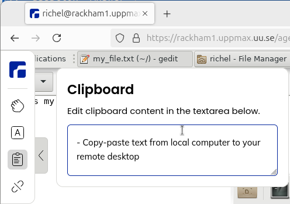
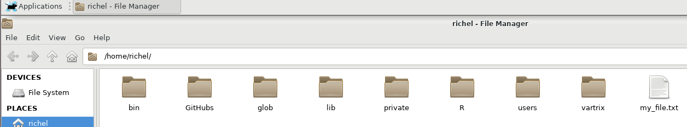

---
tags:
    - lesson
    - remote
    - desktop
    - environment
    - use
    - usage
    - graphical
---

# Use the remote desktop environment

!!!- info "Learning outcomes"

    - Practice using the UPPMAX documentation
    - Can navigate the file system
    - Can give give the path to my home folder
    - Can find the name of the file explorer
    - Can do basic file management: create, copy, move and delete
      a file and folder
    - Can start a terminal
    - Can start a program from the terminal
    - Can start a visual text editor
    - Can find the name of the visual text editor
    - Can do basic things in the visual text editor: edit, save, close
    - Can copy-paste text between local computer and the remote desktop
      (in both directions)

???- question "For teachers"

    Teaching goals are:

    - Learners have used Thunar
    - Learners have found out that the file explorer is called Thunar
    - Learners have done basic file management:
      create, copy, move and delete a file and folder
    - Learners have started a terminal
    - Learners have started `gedit`
    - Learners have found that the text editor is called `gedit`
    - Learners have done basic things in gedit: edit a files, save, close
    - Learners have copy-pasted text between local computer
      and the remote desktop (in both directions)

    Lesson plan:

    ```mermaid
    gantt
      title Using the remote desktop
      dateFormat X
      axisFormat %s
      section First hour
      Prior : prior, 0, 5s
      Present: present, after prior, 2s
      %% It took me 5 mins, here I do that time x2
      Challenge: crit, challenge, after present, 10s
      %% Here I use the same time it took me to give feedback
      Feedback: feedback, after challenge, 5s
    ```

    Prior questions:

    - Do you expect it to be hard to use a remote desktop environment?
    - Do you expect there to be much different behavior
      when using a remote desktop environment?
    - How do you think the folder structure looks on the UPPMAX HPC clusters?
    - What is the purpose of a home folder?
    - What is the purpose of a project folder?
    - What is the purpose of a `nobackup` folder?
    - Does someone have already tried to copy-past text between
      local computer and remote desktop?

    Feedback questions:

    - What is the difference between a home and a project folder?
    - Assume you've put your research data in a `nobackup` folder.
      You accidentally deleted your data.
      What can UPPMAX do to help you?
    - How to paste to a remote desktop?

## Why?

After [logging in to the remote desktop](login_remote_desktop.md),
we can work with Pelle. Let's make sure we can do so :-)

Here we start to feel at ease using the remote desktop environment.
Most exercises (e.g. creating a file) will be intuitive to do.

The goal is to make sure you can indeed do all these 'simple' things,
as maybe you'll be too afraid to ask a colleague later.

## Exercises

???- question "Need a video?"

    See [this YouTube video that shows the solution of these exercises](https://youtu.be/XiPoHNs2SDQ)

    Pelle works the same a Rackham in these contexts.

It is assumed you are logged in to the remote desktop environment of Pelle.

No need to read the documentation here:
we'll take a look at the (Linux) filesystem of Pelle.

Try to do these exercises by trying out things yourself first.
There are usually multiple ways to solve the exercise.
Feel encouraged to explore this new environment too!

## Exercise 1: copy-paste text

Go to the UPPMAX documentation at
[https://docs.uppmax.uu.se](https://docs.uppmax.uu.se),
then answer these questions:

- Find the page where it is documented to log in to
  Pelle's remote desktop via a webbrowser.

???- question "Answer"

    [The UPPMAX 'Log in to Pelle's remote desktop via a webbrowser' page](http://docs.uppmax.uu.se/getting_started/login_pelle_remote_desktop_website/).

- On that page, find where to find information on how to use the
  remote desktop

???- question "Answer"

    The link can be found at the 'Usage' heading,
    which takes you to [ThinLinc](https://docs.uppmax.uu.se/software/thinlinc/),
    the program that is the workhorse behind the website

- Copy-paste text from local computer to your remote desktop

???- question "Answer"

    Select some text on your local computer and press `CTRL + C` to copy
    it to your loal clipboard.

    Then, click on the menu bar on the left side of the window and click on the
    clipboard icon. Press `CTRL + V` to paste the text from your local
    clipboard to the remote desktop's clipboard

    

    Then, in the remote desktop environment, press `CTRL + V` to paste
    the text from the remote desktop's clipboard to a text editor

    

- Copy-paste text from your remote desktop to your local computer

    In the remote desktop environment, press `CTRL + C` to copy
    the selected text to the remote desktop's clipboard.

    Then, click on the menu bar on the left side of the window and click on the
    clipboard icon. Copy the text in the remote desktop's clipboard using
    `CTRL + C` to your local computer's clipboard.

    Then, on your local computer, press `CTRL + V` to paste
    the text from your clipboard to a text editor

## Exercise 2: file exploration

- Start a program to navigate your files

???- question "Answer"

    

    At the bar at the bottom of the screen, click on the rightmost folder icon
    to open the file explorer. You will be asked in which folder to open
    it (giving away the answer to the next question). Pick any.

- When you start that program, in which directory are you?

???- question "Answer"

    

    When you started the file explorer, you already had to pick a folder,
    giving away the answer to this question.

    In the file explorer, you can read the directory in the top bar.
    For the image above, the directory is called `/home/richel`.

- What is the full path to your home folder (whatever a 'home folder' is)?

???- question "Answer"

    

    When you started the file explorer, pick the top option 'Open folder'
    to open up your home folder.

    It's full path is `/home/[your UPPMAX username]`, where `[your UPPMAX username]`
    is your UPPMAX username.
    For the image above, the username was `richel` and hence the home directory
    is called `/home/richel`.

- What is the name of the file explorer?

???- question "Answer"

    In the file explorer, click on `Help | About`:

    

    It shows the name of the file explorer:

    

    The file navigator is called Thunar.

## Exercise 3: file management

In your file explorer:

- create a file

???- question "Answer"

    In Thunar, click on the white space next/under the files with
    the right mouse button. In this pop-up menu, click 'Create a new file':

    

    In the following dialog, give it any filename:

    

    Now the file is created:

    

- copy a file

???- question "Answer"

    There are multiple ways, here is one:

    - Click on a file to select it
    - Press `CTRL-C` to copy it
    - Navigate to a folder
    - Press `CTRL-V` to paste it

- move a file

???- question "Answer"

    There are multiple ways, here is one:

    - Click on a file to select it
    - Press `CTRL-X` to cut it
    - Navigate to a folder
    - Press `CTRL-V` to paste it

- delete a file

???- question "Answer"

    There are multiple ways, here is one:

    - Click on a file to select it
    - Press `Del` to cut it

- create a folder

???- question "Answer"

    There are multiple ways, here is one:

    - Right-click on empty space in a folder
    - In the pop-up menu, click 'Create folder'

- copy a folder

???- question "Answer"

    There are multiple ways, here is one:

    - Click on a folder to select it
    - Press `CTRL-C` to copy it
    - Navigate to a folder
    - Press `CTRL-V` to paste it

- move a folder

???- question "Answer"

    There are multiple ways, here is one:

    - Click on a folder to select it
    - Press `CTRL-X` to cut it
    - Navigate to a folder
    - Press `CTRL-V` to paste it

- delete a folder

???- question "Answer"

    There are multiple ways, here is one:

    - Click on a folder to select it
    - Press `Del` to delete it

## Exercise 4: starting a text editor

- Create a file called `my_file.txt` (the `.txt` at the end is important),
  if not already present
- Edit a file by start a visual text editor from Thunar. There are many ways!

???- question "Answer"

    Here there are multiple ways:

    - Double-click the file. Because the file ends with `.txt` it will
      open a visual text editor

    

    - Do a right-mouse button click on the file
      and select 'Open with text editor'

    It will look similar to this:

    

To be able to search the web for questions on this graphical text editor,
its name will be useful to know:

- What is the name of the graphical text editor?

???- question "Answer"

    The visual text editor is called 'gedit'.

     You can see its name in the menu bar at the top:

    

    You can also click on
    [the hamburger button](https://en.wikipedia.org/wiki/Hamburger_button)
    and click 'Help':

    

    This will show you the gedit about screen:

    

- Save the file. There are multiple ways!

???- question "Answer"

    There are multiple ways, these are among the most conventional:

    - Press `CTRL + S`
    - Click on the 'Save' button at the top menu bar of gedit

    

- Close gedit. There are multiple ways!

???- question "Answer"

    These are some of the more conventional ways to close gedit:

    - Click on the `x` at the top-right of the terminal
    - In the gedit hamburger menu, click 'Quit'

    


## Exercise 5: starting a terminal

- Start a terminal

???- question "Answer"

    At the bottom bar of the screen, click the icon for 'Terminal emulator':

    

    You now have started a terminal:

    

- From the terminal, start the program `eog` by typing `eog` and
  press enter,

???- question "Answer"

    These `eog` menu will show up:

    

- Close the menu

