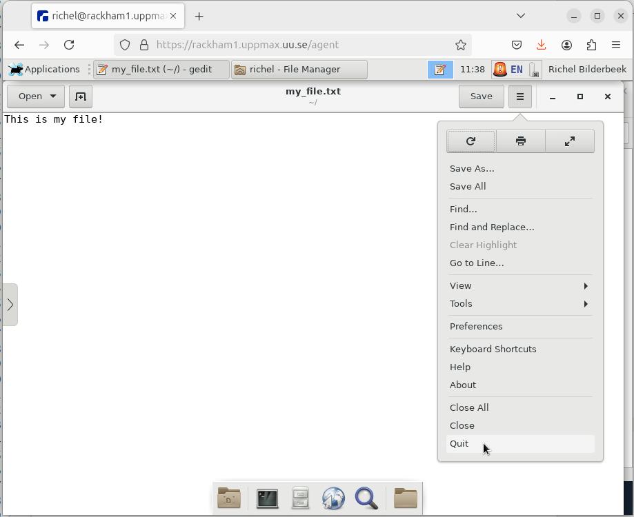

# Use the console environment

!!!- info "Learning objectives"

    - Can navigate the file system
    - Can do basic file management: create, copy, move and delete a file and folder
    - Can copy-paste text between local computer and the terminal (in both directions)

???- question "For teachers"

    Teaching goals are:

    - ...

    Lesson plan:

    ```mermaid
    gantt
      title Something
      dateFormat X
      axisFormat %s
      section First hour
      Course introduction: done, course_intro, 0, 10s
      Prior : intro, after course_intro, 5s
      Present: theory_1, after intro, 5s
      Challenge: crit, exercise_1, after theory_1, 40s
      Break: crit, milestone, after exercise_1
      section Second hour
      Challenge: crit, exercise_2, 0, 10s
      Feedback: feedback_2, after exercise_2, 10s
      SLURM: done, slurm, after feedback_2, 25s
      Break: done, milestone, after slurm
    ```

    Prior questions:

    - Do you expect it to be hard to use a console environment?
    - Do you expect there to be much different behavior
      when using a console environment?
    - Does someone have already tried to copy-past text between
      local computer and a terminal?

## Why?

Every UPPMAX user need to use the terminal at some point.
Let's make sure we use it well :-)

Here we do the same exercises as when using the remote desktop environment.

The goal is to make sure you can indeed do all these 'simple' things,
as maybe you'll be too afraid to ask a colleague later.

## Learning Linux

Using a terminal and getting comfortable with Linux
may not be the most intuitive.
Luckily, Linux is heavily used and there are many
fora, websites and books
written about it.

One such book is [The Linux Command Line](https://linuxcommand.org/tlcl.php),
which is available in both print and online:


> Book cover of 'The Linux Command Line'


## Exercises

It is assumed you are logged in to the console environment of Rackham
with a terminal. 
In case you did not get this to work,
login via the remote desktop website and start a terminal there.

You are encouraged to search the internet for the answer yourself.
Or, if you prefer, use the links to the relevant chapters
in the book 'The Linux Command Line'. Or any other way!

Try to do these exercises by trying out things yourself first.
There are usually multiple ways to solve the exercise.
Feel encouraged to explore this new environment too!

### Exercise 1: file navigation

- You are in a terminal on a Rackham login node. Find out the directory you are in: which command do you use?

???- tip "Tips"

    - Tip 1: search for 'Linux present working directory command'
    - Tip 2: scan the [the 'Navigation' chapter in 'The Linux Command Line'](https://linuxcommand.org/lc3_lts0020.php)

???- question "Answer"

    The command to use is `pwd`, short for 'Present working directory':

    ```bash
    pwd
    ```

    You output will look similar to this:

    ```bash
    [sven@rackham2 ~]$ pwd
    /home/sven
    ```

### Exercise 2: file management

You are in a terminal on a Rackham login node, in your home folder. 

From there:

- Find out which files are in your home folder from the terminal.
  This is exactly the same as displayed in the file explorer
  in the remote desktop

???- tip "Tips"

    - Tip 1: search for 'Linux display files in current folder'
    - Tip 2: scan the [the 'Looking around' chapter in 'The Linux Command Line'](https://linuxcommand.org/lc3_lts0030.php)


???- question "Answer"

    The command to use is `ls`, short for 'List':

    ```bash
    ls
    ```

    You output will look similar to this:

    ```bash
    [sven@rackham3 ~]$ ls
    bin  GitHubs  glob  lib  private  R  users
    [sven@rackham3 ~]$ 
    ```


- create a file called `test.txt`

???- tip "Tips"

    - Tip 1: search for 'Linux create file'
    - Tip 2: this command is _not_ mentioned in the book 'The Linux Command Line'

???- question "Answer"

    The command to use is `touch`:

    ```bash
    touch test.txt
    ```

    You output will look similar to this:

    ```
    [sven@rackham2 ~]$ touch test.txt
    [sven@rackham2 ~]$ 
    ```

- Find out which files are in your home folder from the terminal again,
  to confirm test.txt is indeed created

???- question "Answer"

    The command to use is `ls`:

    ```bash
    ls
    ```

    You output will look similar to this:

    ```bash
    [richel@rackham3 ~]$ ls
    bin  GitHubs  glob  lib  private  R  test.txt  users
    [richel@rackham3 ~]$ 
    ```

- copy the file `test.txt` to `copy.txt` and confirm that it worked

???- tip "Tips"

    - Tip 1: search for 'Linux copy file'
    - Tip 2: scan the [the 'Manipulating files' chapter in 'The Linux Command Line'](https://linuxcommand.org/lc3_lts0050.php)

???- question "Answer"

    The command to use is `cp`:

    ```bash
    ls
    ```

    You output will look similar to this:

    ```
    [richel@rackham3 ~]$ cp test.txt copy.txt
    [richel@rackham3 ~]$ ls
    bin  copy.txt  GitHubs  glob  lib  private  R  test.txt  users
    ```

- delete the file `copy.txt` and confirm that it worked

???- tip "Tips"

    - Tip 1: search for 'Linux delete file'
    - Tip 2: scan the [the 'Manipulating files' chapter in 'The Linux Command Line'](https://linuxcommand.org/lc3_lts0050.php)

???- question "Answer"

    The command to use is `rm`:

    ```bash
    rm copy.txt
    ```

    You output will look similar to this:

    ```
    [richel@rackham3 ~]$ rm copy.txt
    [richel@rackham3 ~]$ ls
    bin  GitHubs  glob  lib  private  R  test.txt  users
    ```

- rename the file `test.txt` to `test2.txt` and confirm that it worked

???- tip "Tips"

    - Tip 1: search for 'Linux rename file'
    - Tip 2: scan the [the 'Manipulating files' chapter in 'The Linux Command Line'](https://linuxcommand.org/lc3_lts0050.php)

???- question "Answer"

    The command to use is `mv`, short for 'Move':

    ```bash
    mv test.txt test2.txt
    ```

    You output will look similar to this:

    ```
    [richel@rackham3 ~]$ mv test.txt test2.txt
    [richel@rackham3 ~]$ ls
    bin  GitHubs  glob  lib  private  R  test2.txt  users
    ```

- create a folder `my_folder` and confirm that it worked

???- tip "Tips"

    - Tip 1: search for 'Linux create folder'
    - Tip 2: scan the [the 'Manipulating files' chapter in 'The Linux Command Line'](https://linuxcommand.org/lc3_lts0050.php)

???- question "Answer"

    The command to use is `mkdir`, short for 'Make directory'

    ```bash
    mkdir my_folder
    ```

    You output will look similar to this:

    ```
    [richel@rackham2 ~]$ mkdir my_folder
    [richel@rackham2 ~]$ ls
    bin  GitHubs  glob  lib  my_folder  private  R  test2.txt  users
    [richel@rackham2 ~]$ 
    ```


- copy the `my_folder` folder to `my_copy` and confirm that it worked

???- tip "Tips"

    - Tip 1: search for 'Linux copy folder recursively'
    - Tip 2: scan the [the 'Manipulating files' chapter in 'The Linux Command Line'](https://linuxcommand.org/lc3_lts0050.php)

???- question "What does `cp: omitting directory ‘my_folder’` mean?"

    This happens if you copy non-recursively, i.e. if you forget the `-R` flag. 
    You'll see:

    ```bash
    [richel@rackham2 ~]$ cp my_folder my_copy
    cp: omitting directory ‘my_folder’
    ```

    When trying to copy a folder without `-R`, this warning
    is given and no folder is copied.
    

???- question "Answer"

    The command to use is `cp` with the `-R` flag, where `-R`
    denotes 'recursively':

    ```bash
    cp -R my_folder my_copy
    ```

    You output will look similar to this:

    ```
    [richel@rackham2 ~]$ cp -R my_folder my_copy
    [richel@rackham2 ~]$ ls
    bin  GitHubs  glob  lib  my_copy  my_folder  private  R  test2.txt  users
    [richel@rackham2 ~]$ 
    ```

    If you forget the `-R` flag, you'll see:

    ```bash
    [richel@rackham2 ~]$ cp my_folder my_copy
    cp: omitting directory ‘my_folder’
    ```

    When trying to copy a folder without `-R`, this warning
    is given and no folder is copied.


- delete the `my_copy` folder and confirm that it worked

???- tip "Tips"

    - Tip 1: search for 'Linux delete folder'
    - Tip 2: scan the [the 'Manipulating files' chapter in 'The Linux Command Line'](https://linuxcommand.org/lc3_lts0050.php)

???- question "Answer"

    The command to use is `rm` with the `-R` flag, where `-R`
    denotes 'recursively':

    ```bash
    rm -R my_copy/
    ```

    You output will look similar to this:

    ```bash
    [richel@rackham2 ~]$ rm -R my_copy/
    [richel@rackham2 ~]$ ls
    bin  GitHubs  glob  lib  my_folder  private  R  test2.txt  users
    ```

    If you forget the `-R` flag, you'll see:

    ```bash
    [richel@rackham2 ~]$ rm my_copy/
    rm: cannot remove ‘my_copy/’: Is a directory
    ```

    When trying to rename a folder without `-R`, this warning
    is given and no folder is renamed.

- rename the `my_folder` folder to `my_best_folder` and confirm that it worked

???- tip "Tips"

    - Tip 1: search for 'Linux rename folder'
    - Tip 2: scan the [the 'Manipulating files' chapter in 'The Linux Command Line'](https://linuxcommand.org/lc3_lts0050.php)

???- question "Answer"

    The command to use is `mv`:

    ```bash
    mv my_folder my_best_folder
    ```

    You output will look similar to this:

    ```bash
    [richel@rackham2 ~]$ mv my_folder my_best_folder
    [richel@rackham2 ~]$ ls
    bin  GitHubs  glob  lib  my_best_folder  private  R  test2.txt  users
    ```

    If you add the `-R` flag, you'll see:

    ```bash
    [richel@rackham2 ~]$ mv -R my_folder my_best_folder
    mv: invalid option -- 'R'
    Try 'mv --help' for more information.
    ```

    When trying to move a folder with `-R`, this warning
    is given and no folder is renamed.

### Exercise 3: starting `xeyes`

- From the terminal, start the program `xeyes` by typing `xeyes` and
  press enter,

???- question "Answer"

    These eyes will show up:

    

- Close `xeyes`

???- question "Answer"

    Here is how to close a program in the terminal:

    Press `CTRL + C`

### Exercise 4: starting a text editor

- Create a file called `my_file.txt`, if not already present

???- question "Answer"

    ```bash
    touch my_file.txt
    ```

- Edit the file by opening it with the `nano` text editor

???- question "Answer"

    Type:

    ```bash
    nano my_file.txt
    ```


To be able to search the web for questions on this graphical text editor,
its name will be useful to know:

- What is the name of the graphical text editor?

???- question "Answer"

    The visual text editor is called 'gedit'. 

     You can see its name in the menu bar at the top:

    

    You can also click on [the hamburger button](https://en.wikipedia.org/wiki/Hamburger_button) and click 'Help':

    

    This will show you the gedit about screen:

    

- Save the file. There are multiple ways!

???- question "Answer"

    There are multiple ways, these are among the most conventional:

    - Press `CTRL + S`
    - Click on the 'Save' button at the top menu bar of gedit

    

- Close gedit. There are multiple ways!

???- question "Answer"

    These are some of the more conventional ways to close gedit:

    - Click on the `x` at the top-right of the terminal
    - In the gedit hamburger menu, click 'Quit'

    

### Exercise 5: copy-paste text

Go to the UPPMAX documentation at [https://docs.uppmax.uu.se](https://docs.uppmax.uu.se),
then answer these questions:

- Find the page where it is documented to log in to Rackham's remote desktop via a webbrowser.

???- question "Answer"

    The page is [here](http://docs.uppmax.uu.se/getting_started/login_rackham_remote_desktop_website/).

- On that page, find where to find information on how to use the
  remote desktop

???- question "Answer"

    The link can be found at the 'Usage' heading,
    which takes you to [ThinLinc](https://docs.uppmax.uu.se/software/thinlinc/),
    the program that is the workhorse behind the website

- Copy-paste text from local computer to your remote desktop

???- question "Answer"

    Select some text on your local computer and press `CTRL + C` to copy
    it to your loal clipboard.

    Then, click on the menu bar on the left side of the window and click on the
    clipboard icon. Press `CTRL + V` to paste the text from your local
    clipboard to the remote desktop's clipboard

    

    Then, in the remote desktop environment, press `CTRL + V` to paste
    the text from the remote desktop's clipboard to a text editor

    

- Copy-paste text from your remote desktop to your local computer

    In the remote desktop environment, press `CTRL + C` to copy
    the selected text to the remote desktop's clipboard.

    Then, click on the menu bar on the left side of the window and click on the
    clipboard icon. Copy the text in the remote desktop's clipboard using
    `CTRL + C` to your local computer's clipboard.

    Then, on your local computer, press `CTRL + V` to paste
    the text from your clipboard to a text editor


# Use a terminal

!!!- info "Learning objectives"

    - Understands what the prompt is
    - Can copy-paste to/from a terminal
    - Can use tab-completion with the prompt


???- question "For teachers"

    Prerequisites are:

    - [...]

    Preparations are:

    - [...]

    Teaching goals are:

    - [...]


    Lesson plan:

    ```mermaid
    gantt
      title Something
      dateFormat X
      axisFormat %s
      section First hour
      Course introduction: done, course_intro, 0, 10s
      Prior : intro, after course_intro, 5s
      Present: theory_1, after intro, 5s
      Challenge: crit, exercise_1, after theory_1, 40s
      Break: crit, milestone, after exercise_1
      section Second hour
      Challenge: crit, exercise_2, 0, 10s
      Feedback: feedback_2, after exercise_2, 10s
      SLURM: done, slurm, after feedback_2, 25s
      Break: done, milestone, after slurm
    ```

    Prior questions:

    - [...]


## Why?

[...]

## Theory

- When logging in to UPPMAX from your local computer you will arrive to your home folder at the login node.
- This means that only light analysis and and calculations should be made here.
- You will see this in the prompt after "@" as the clustername and a low number. For instance:

   ```console
      [<user>@rackham3 linux_tutorial]$
    ```

- You will later learn how to reach the calculation nodes. Then the prompt states the node number with a single letter, like "r" for Rackham. For instance:

   ```console
      [<user>@r484 linux_tutorial]
   ```


## Exercises

[...]

### Working form

[...]

### Exercise 1: general understanding

- Understands what the prompt is

[Theory questions here]

### Exercise 2: copy-paste to/from a terminal

- Can copy-paste to/from a terminal

### Exercise 3: tab-completion

- Can use tab-completion with the prompt
