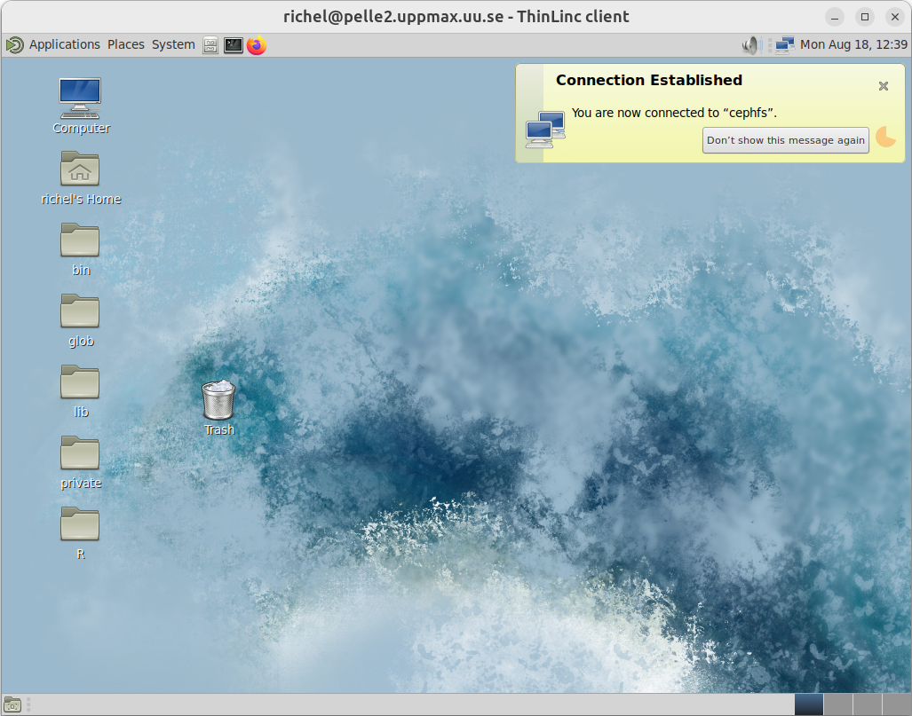

---
tags:
    - summary
    - further
    - future
    - learning
    - courses
---

# Summary

You can login to the Pelle remote desktop using the website
at [https://pelle-gui.uppmax.uu.se/](https://pelle-gui.uppmax.uu.se/).



You can transfer files to/from Pelle.


You can log in to Pelle using a terminal:

```bash
ssh sven@pelle.uppmax.uu.se
```

You can find and load a software module:

```bash
module spider cowsay
module load cowsay/3.04
```

You can start a terminal text editor:

```bash
nano
```

You can create a bash script:

```bash
nano my_script.sh
```

You can schedule a job:

```bash
sbatch -A uppmax2025-2-262 my_script.sh
```

You can start an interactive session:

```bash
interactive -A uppmax2025-2-262 -t 1:00:00
```

You can start an IDE


## Further learning

At the end of this day, you should be comfortable in using an UPPMAX
HPC cluster.

These are possible next steps:

- [Intro to UPPMAX days 2 and 3](https://docs.uppmax.uu.se/courses_workshops/uppmax_intro_course/):
  the next two days, where we'll go deeper into using our UPPMAX systems
- [The SCoRe overview of courses](https://nbisweden.github.io/SCoRe_user_doc/courses/):
  this includes all courses by NAISS and SciLifeLab and more
- [The Programming Formalisms course](https://uppmax.github.io/programming_formalisms/)
  teaches how to do programming well, according to the practices in the
  literature
- [The NAISS file transfer course](https://uppmax.github.io/naiss_file_transfer_course/)
  will help you upload and download data to/from your favorite HPC cluster
