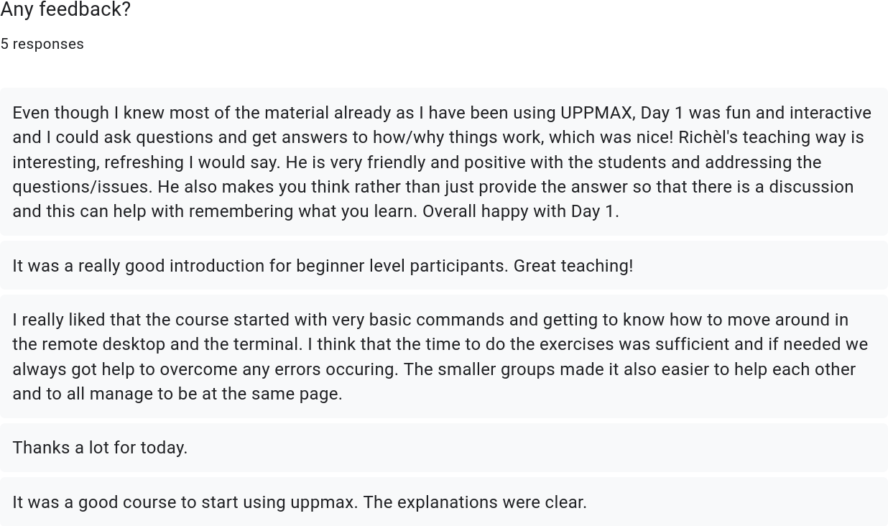
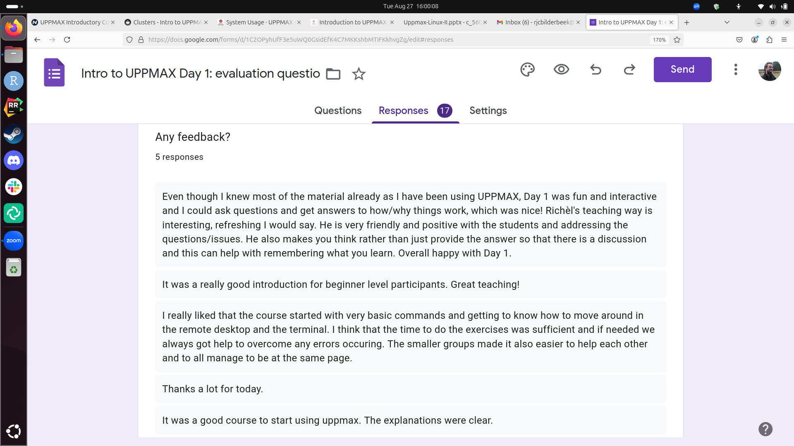

# Survey feedback

These are the evaluation questions. The goals of these questions is to find out how successful the course is in achieving its teaching goals.

Give you confidence levels of the following statements, using this scale:

    0: I don't know even what this is about ...?
    1: I have no confidence I can do this
    2: I have low confidence I can do this
    3: I have some confidence I can do this
    4: I have good confidence I can do this
    5: I absolutely can do this!

Give you confidence levels of the following statements below:

### I can log in to the Rackham remote desktop using the website

- 0: I don't know even what this is about ...?
- 1: I have no confidence I can do this
- 2: I have low confidence I can do this
- 3: I have some confidence I can do this
- 4: I have good confidence I can do this
- 5: I absolutely can do this!

    1. I can log in to the Rackham remote desktop using the website
    2. I can do basic things in the Rackham remote desktop
    3. I can transfer files to/from Rackham using FileZilla
    4. I can log in to Rackham using a terminal
    5. I can do basic things in the terminal
    6. I can transfer files to/from Rackham using scp
    7. I can start an interactive session
    8. I can find and load a module
    9. I can start an IDE
    10. I can start a terminal text editor
    11. I can create a bash script
    12. I can schedule a job
    13. I can conclude which UPPMAX cluster best suits my needs
    14. I can find the hardware specifications of an UPPMAX cluster
    15. I can find where to apply for NAISS resources
    16. I can find other UPPMAX courses

## Any feedback?

5 responses

Even though I knew most of the material already as I have been using UPPMAX, Day 1 was fun and interactive and I could ask questions and get answers to how/why things work, which was nice! Richèl's teaching way is interesting, refreshing I would say. He is very friendly and positive with the students and addressing the questions/issues. He also makes you think rather than just provide the answer so that there is a discussion and this can help with remembering what you learn. Overall happy with Day 1.
It was a really good introduction for beginner level participants. Great teaching!
I really liked that the course started with very basic commands and getting to know how to move around in the remote desktop and the terminal. I think that the time to do the exercises was sufficient and if needed we always got help to overcome any errors occuring. The smaller groups made it also easier to help each other and to all manage to be at the same page. 
Thanks a lot for today.
It was a good course to start using uppmax. The explanations were clear.

