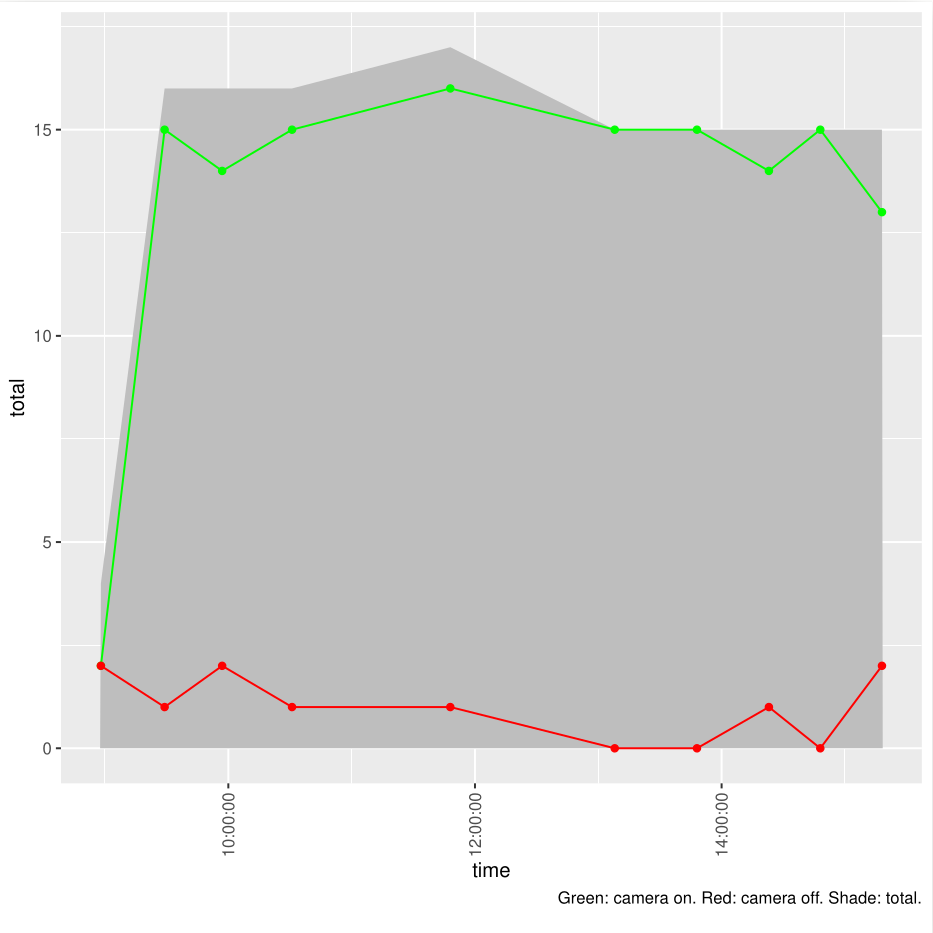
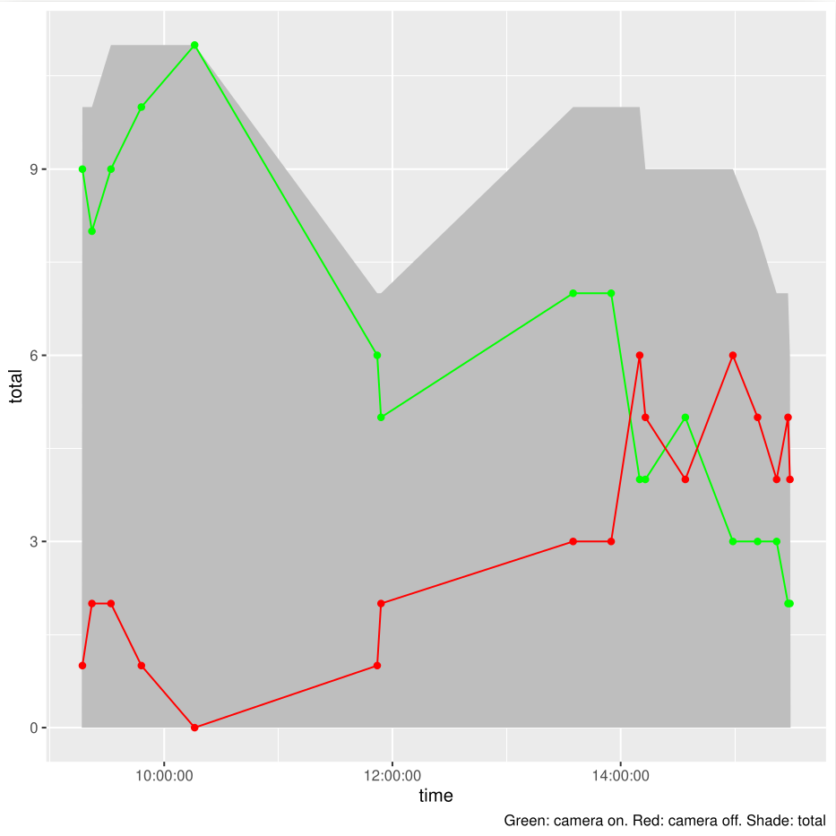
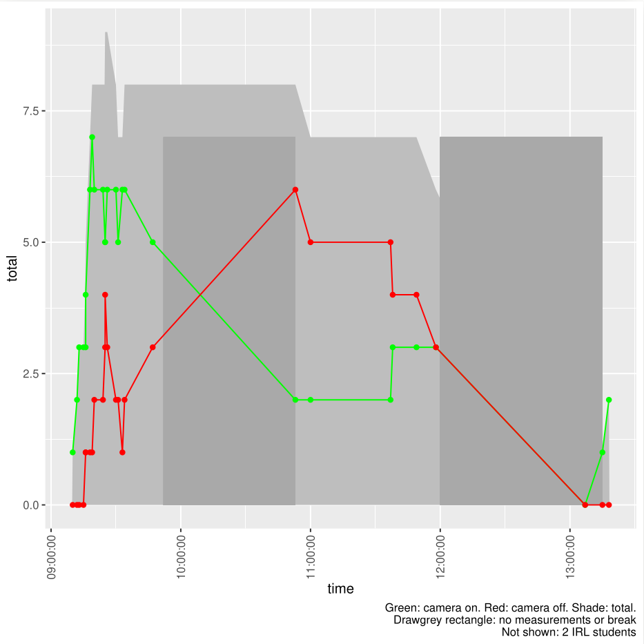

# Reflection 2024-08-27

They day went as good as expected.
I decided to use a group size of 3 people and that was
a god decision. I used the standard exercise setup I've
been using
[as on my website on teaching 'Duo's in Breakout rooms'](https://github.com/richelbilderbeek/teaching/blob/master/exercise_procedures/duos_in_breakout_rooms.md).

I am happy how interactive my course was.
Here you can see the amount of learners in time with a camera on/off:

> Learners in my course

Notice how well I was able to maintain having the initial amount of learners
for an online course, even though I encouraged two learners to leave
early (and they did), as they already knew the course's content.

Here are similar plots for other courses:

> Learners in other course

> Learners in another course

> Learners in yet another course

> Learners in yet another course

The learners were quite helpful in helping each other out and I thanked each
of them that did so, especially if they share their screens.

There were some learners that finished earlier (i.e. they finished
the exercise of 'interactive', before the other two-thirds of the group
would start it). I took these learners apart and sent them to the evaluation
earlier.

From the chat:

> 11:30:15 From Nauras Daraghmeh To [Teacher] Richèl 'Rea-shell' Bilderbeek(direct message):
>	dont worry, the course material online is really good. i am currently going through it. i will get myself up to date regarding the basics. [...]

From the survey feedback (5 responses):

- Even though I knew most of the material already as I have been using UPPMAX, Day 1 was fun and interactive and I could ask questions and get answers to how/why things work, which was nice! Richèl's teaching way is interesting, refreshing I would say. He is very friendly and positive with the students and addressing the questions/issues. He also makes you think rather than just provide the answer so that there is a discussion and this can help with remembering what you learn. Overall happy with Day 1.
- It was a really good introduction for beginner level participants. Great teaching!
- I really liked that the course started with very basic commands and getting to know how to move around in the remote desktop and the terminal. I think that the time to do the exercises was sufficient and if needed we always got help to overcome any errors occuring. The smaller groups made it also easier to help each other and to all manage to be at the same page. 
- Thanks a lot for today.
- It was a good course to start using uppmax. The explanations were clear.

From the anonymous feedback (2 responses):

- The course material was very easy to understand and follow. The course had a nice pace for beginners and Richèl Bilderbeek did a great job!
- Great first day Richèl. Mindful of everyone's time needed for each task. 

